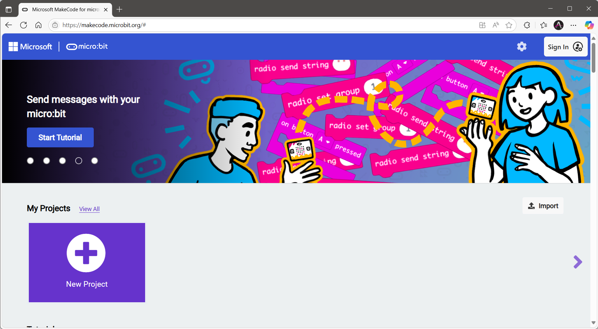

# QuickStart

### **Get the Software**
You can use the programming software in two ways: online through the [cloud platform](https://makecode.microbit.org), or by downloading and installing the [offline software](https://makecode.microbit.org/offline-app). In this tutorial, we will use the online programming platform.

Click the link above to access the online programming platform, where you will see the main interface as shown below.

### **Get the Extension**
The **MakeCode** coding platform has a dedicated **micro:bit extension** for the **micro:bit Smart Hub**. You can add this extension to both the online and offline versions of the platform. Click [here](https://drive.google.com/file/d/1bILxV2i6-iILTsbRQJ_YH4vJL2GzuTuO/view?usp=drive_link) to download the latest version of the **micro:bit extension**.

### **How to connect device and download program.**
Follow the steps  [here](https://drive.google.com/file/d/18hOd-NfBvwm8e54vW3z5LAS3LK58nLMZ/view?usp=drive_link) 

### **Find more detailed the video tutorials ** [here.](https://www.youtube.com/watch?v=kck-XzAsSjM&list=PLscVLoYXLLuTCQjUZbDd7PDn5nlbZ4xUx) 

### Enjoy!

