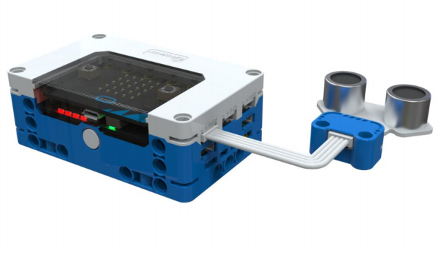
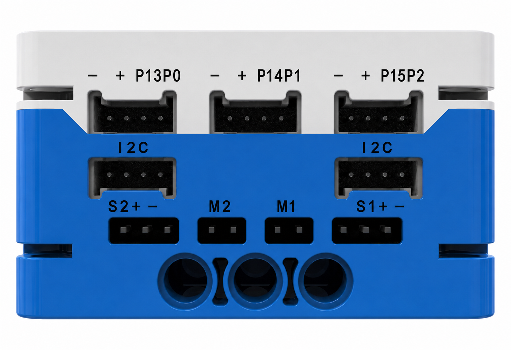
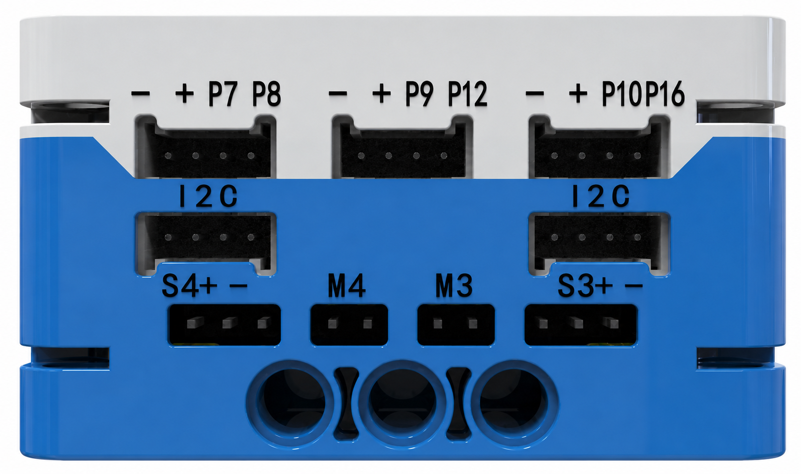
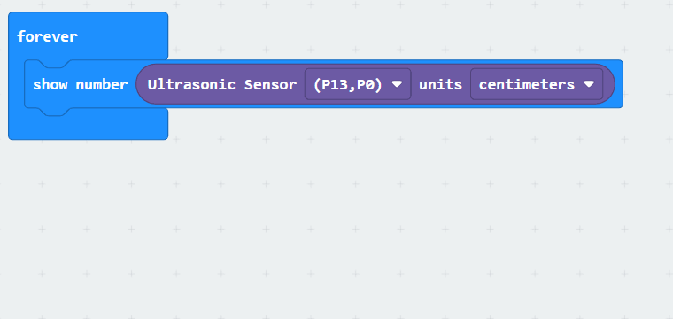

# Ultrasonic Sensor
## **Principle**
The Long-Range Photoelectric Sensor is a detection switch designed based on the infrared reflection principle. Its primary function is to accurately detect whether an obstacle is present in front of the sensor, with an effective detection range of 0 to 2 meters. In addition, the sensor is equipped with an adjustable potentiometer, allowing users to flexibly adjust the detection parameters to meet the requirements of various application scenarios.  

## Specifications
| Item | **Description** |
| :---: | :---: |
| Name |  Ultrasonic Sensor   |
| Code | B0020012 |
|  Dimensions   | 47×43 mm |
|  Voltage   | 5V - DC |
| Data Type | Analog Signal |
| Data Range | 2~400 cm |
| Ports | Grove |

## **Usage**
|  | | |
| :---: | --- | --- |
|  |  |  |
| _Side View_ | _Front View_ | _Side View_ |

The ultrasonic sensor can be connected to the general-purpose sensor ports of the **micro: bit smart hub**, including **P0-P13**, **P1-P14**, **P2-P15**, **P7-P8**, **P9-P12**, and **P10-P16**. It is programmed for distance measurement tasks.  

The sensor measures the distance between an object and itself. Once installed in a fixed position, it emits ultrasonic pulses and receives reflected waves to calculate distance based on the time difference. Proper sensor placement is crucial to avoid interference from obstacles. Environmental factors like temperature, humidity, and airflow can affect sensor performance. Additionally, the shape, material, and surface smoothness of the detected object impact wave reflection; flat and hard surfaces reflect sound waves more effectively.

## Modular Coding  

Using the **MakeCode** coding software, the Microbit extension allows for coding to read signal values from ports such as **P0** and **P13**. The data can be visualized on the **micro: bit LED matrix display**.  

The ultrasonic sensor’s return values can be expressed in three units:

+ **Centimeters (cm)**: Measures distance in metric units.
+ **Microseconds (µs)**: Indicates the time taken for the ultrasonic wave to travel from emission to reception.
+ **Inches (in)**: Represents distance in imperial units.

By measuring the echo time, the corresponding distance can be calculated using the speed of sound, enabling precise measurement of the target object.

