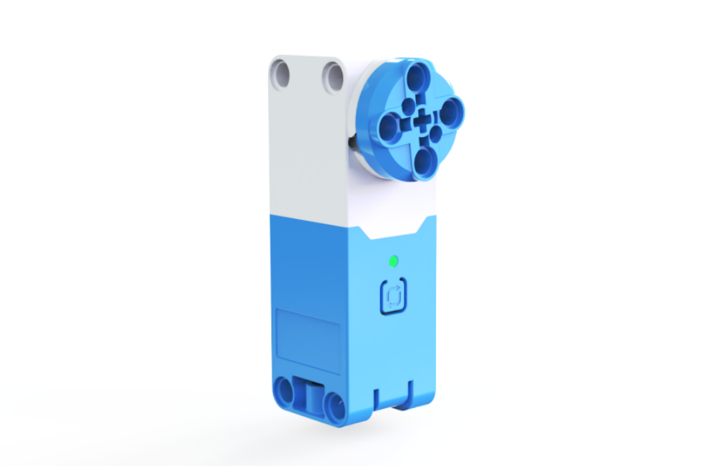
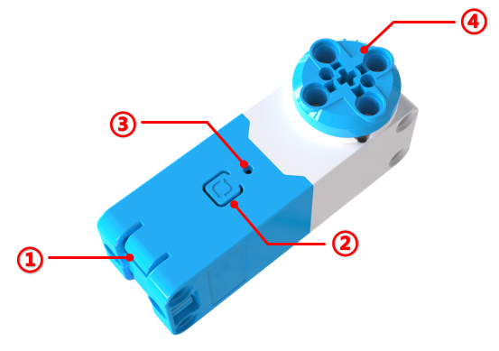
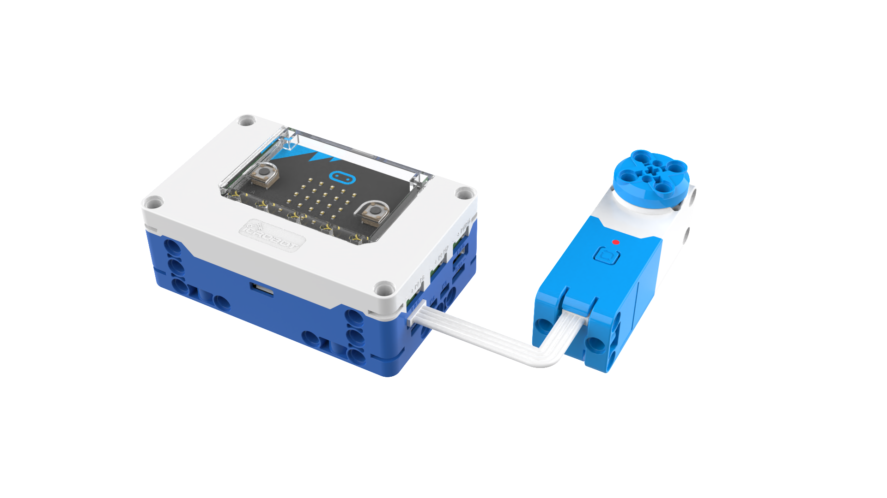
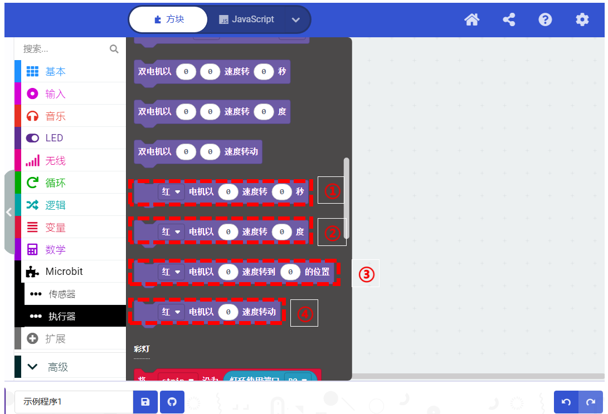
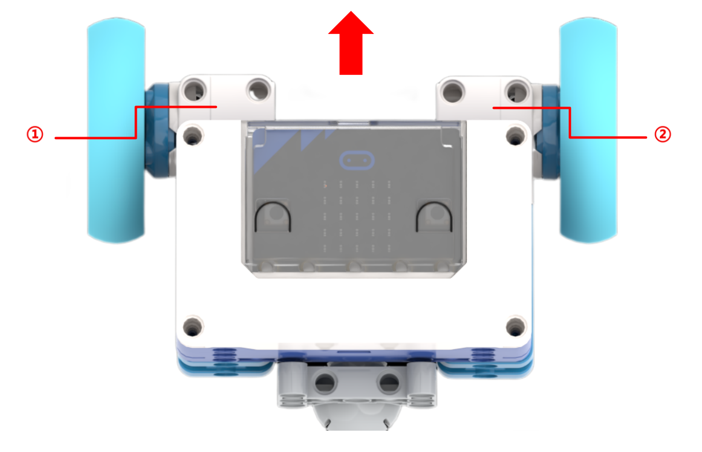
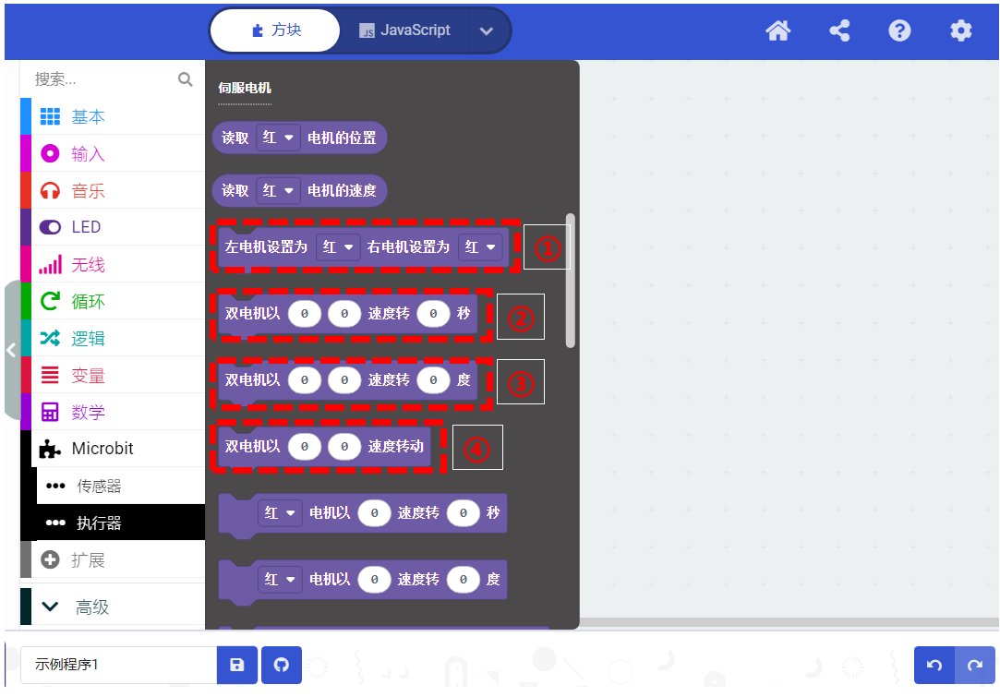
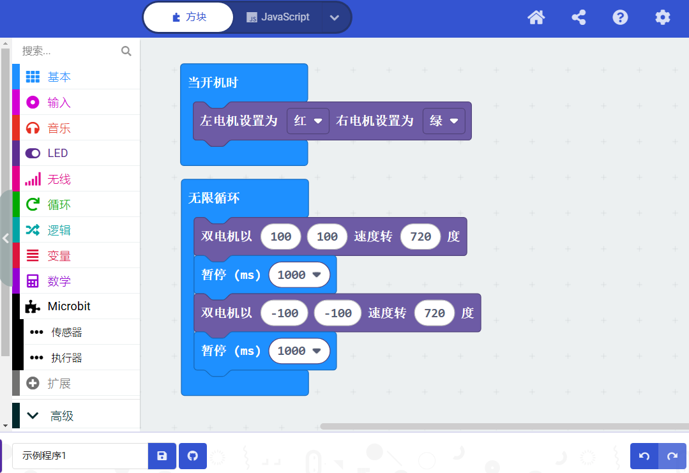

# Servo Motor
## Introduction  

The servo motor is a versatile module that supports multiple rotation control modes, enabling precise control of rotation angles, speed, and position. It uses I²C digital communication for high-speed, latency-free data interaction with controllers. The motor features an I²C address switch button and a status indicator light, allowing users to easily display the current device address and control status. Its plug-and-play terminal connection simplifies wire replacement, addressing the issue of repair difficulties caused by non-detachable wiring.  

**Key Features:**

+ Standard I²C communication protocol.  
+ Manual I²C slave address switching with 4 selectable addresses and 1 built-in address, supporting multiple motors effortlessly.  
+ Built-in smart speed adjustment algorithm for fast response, precise speed measurement, and position calculation.  
+ High torque output.  
+ Built-in intelligent protection algorithms to automatically detect and protect against abnormal conditions like stalling or over-torque.  
+ Hardware protection to limit output power during overheating or other anomalies.
+ It has the communication status indication function to view the communication status of the motor and the hub in real time.
+ Control over speed, position, angle, and runtime.  
+ External terminal connection for quick wire replacement.  
+ Multi-directional reserved axle pin connection design.  

##  Structural  

| No.   | Name   | Description   |
| :---: | :---: | --- |
| ① | Grove Port | Connects to the hub using Grove cables.   |
| ②  | Address Switch Button   | Press and hold for 3s to switch the device I²C address. The motor has 4 selectable addresses (0x51, 0x52, 0x53, 0x54) and one built-in address (0x50). Tap to reset the rotation angle and position to 0.   |
| ③  |  Status Indicator Light   | Indicates the I²C device address: red (0x51), green (0x52), blue (0x53), yellow (0x54). When the light matches the corresponding color, it reflects the current address. Flashing indicates communication with the controller, while steady light signals no communication or a connection error.   |
| ④  |  Axle Pin Connection   |  Compatible with building blocks.   |

## Specifications  
| Item | Description |
| :---: | --- |
|  Name   |  Servo Motor   |
| Code | B0100028 |
|  Weight   |  Approx. 47 g   |
|  Dimensions   |  72 × 24 × 32 mm   |
|  Rated Voltage   | 5V－DC |
|  Communication   | I²C  |
|   I²C Address   | 4 switchable addresses (0x51, 0x52, 0x53, 0x54) and 1 built-in address (0x50)   |
|  No-load Current   |  210 mA   |
|      Stall Current   |  2 A   |
|  Stall Protection Activation Time    | 2s |
| Control Accuracy  | ±5° |
|  Stall Torque   |  0.2 N·m   |
|  Rated Speed   |  178 RPM   |
| Port | Grove  |

## Usage Instructions 
1. **Connect the Motor to the Hub**

The servo motor can be connected to any I²C interface on the micro:bit smart hub. A maximum of 4 servo motors can be connected to the hub. Use the Grove cable for the connection.  

2. **Check and Set the Motor's Status Indicator Light Color  **

The servo motor indicates its I²C address through the color of its status indicator light. When programming, the color of the indicator light is also used to locate the motor to be controlled. Therefore, after connecting the servo motor, ensure you check the color of the indicator light. Ensure that the colors of the connected servo motors are not the same. If the indicator lights are of the same color, long-press the address-switching button to change the address before using it.  

> **Note**: Using servo motors with the same indicator light color on the same hub will result in abnormal operation.  
>

3. **Coding Control  **

The following programs allow you to rotate the red motor at 50% speed and obtain the motor's speed or position.  

 Below, we explain the coding blocks for controlling single and double motors.  

### Single Motor Coding Block 

|  No.   |  Description   |
| :---: | --- |
| **①** | Control a motor of a specific color to rotate at a _speed_ for _seconds_. The speed range is -100 to 100, and the time range is 0 to 65535 seconds.   |
| **②** | Control a motor of a specific color to rotate by _degrees_ at a _speed_. The speed range is -100 to 100, and the degree range is -32400 to 32400 degrees.   |
| **③** | This block is for servo mode, where the motor’s position at the moment it is powered on is the 0-point, or the position is set to 0 by pressing the address switch button. Control a motor of a specific color to rotate to _angle_ at a _speed_. The speed range is -100 to 100, and the angle range is -360 to 360 degrees.   |
| **④** |  Control a motor of a specific color to rotate at _speed_. The speed range is -100 to 100.   |

### Double Motor Coding Block  
The dual motor module is mainly used in scenarios where two servo motors are used to build a robot chassis or other applications that require synchronous control of two motors.  

The image above shows an example of a default chassis setup. The red arrow indicates the forward direction of the robot, where motor ① is defined as the left motor and motor ② is defined as the right motor.  

**Servo Motor Coding Example**

| No.   | Description   |
| :---: | --- |
| ① | Set the color of the left and right motors on the robot chassis. Ensure the actual physical motor setup and colors match the default settings.   |
| ② | Control the left and right motors to rotate for _seconds_ at the speeds specified in the two input fields. The speed and time input ranges are the same as those for single motor control.   |
| ③ | Control the left and right motors to rotate by _degrees_ at the speeds specified in the two input fields. The speed and degree input ranges are the same as those for single motor control.   |
| ④ | Control the left and right motors to rotate at the speeds specified in the two input fields. The speed input range is the same as that for single motor control.   |

The following program controls a robot with the left motor as red and the right motor as green to move forward by 720 degrees at 100% speed. After 1s, it will move backward by 720 degrees at 100% speed.

