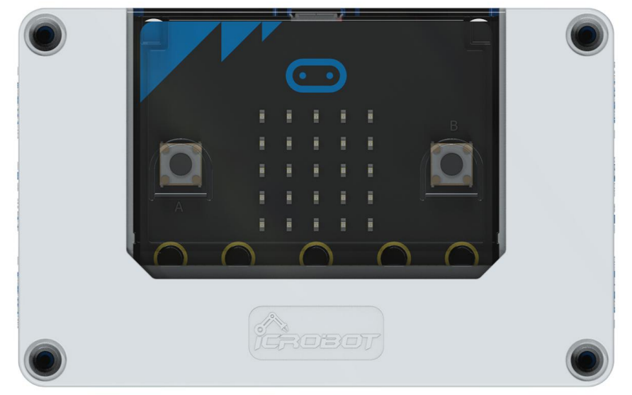

# DC Motor
## **Principle**
The motor is a key component that provides power for various projects. The module is equipped with a universal 2P - 2.54 mm Dupont header for easy circuit connection, simplifying the connection process. Users can easily adjust the motor's speed and direction through simple coding or control methods, enabling precise control of the project.  

## Specifications
| Item  |  Specification   |
| :---: | --- |
| Name | DC Motor |
| Code | B0020019 |
| Voltage | 5V－DC |
|  Dimensions   | 56×24×24 mm |
|  Rated Current   | 100 mA |
| Stall Current   | 1000 mA |
| Maximum Torque   | 0.2 N·m |
| Max Speed   | 10000 r/min |
| Control Signal   |  PWM Signal   |
| Interface Type   | 2P - 2.54 mm Dupont Header (Reversing the connection will only affect the motor's rotation direction)    |

## **Usage**
|  | | |
| :---: | --- | --- |
|  |  |  |
| _Side View_ | _Front View_ | _Side View_ |
| **DC Motor Connection Diagram** | | |

The motor can be connected to the micro:bit smart hub's 4 motor driver interfaces: M1, M2, M3, and M4.  

> **Note**: Under the same program, the direction of the motor will be affected by the way the hardware is connected. Please ensure that the direction of each motor is the same when connecting.  
>

## **Modular Coding**

In the MakeCode coding software, by adding the  micro:bit extension, you can program the motor module to rotate at full power of -255 when the "A" button is pressed and at full power of 255 when the "B" button is pressed.

