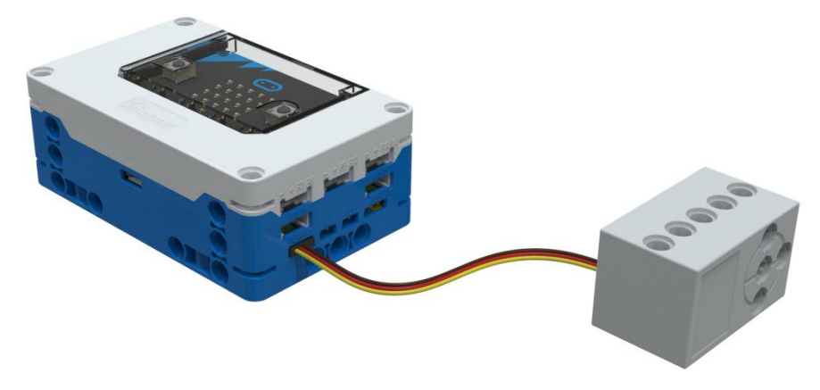
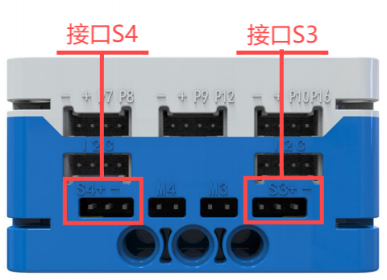
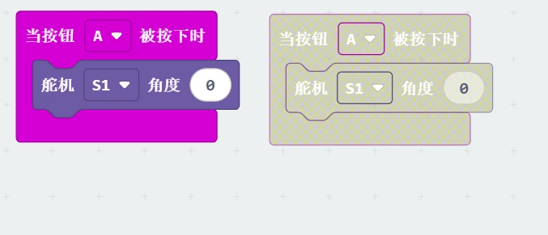

# Geek Servo
## Introduction  
The Geek Servo module can control rotation to precise angles, making it suitable for control systems where the angle needs to change continuously and be maintained. It is compatible with LEGO structural components, with a standard LEGO cross axle for the output shaft. It is primarily used for controlling movement in joints.

## Specifications  
| Item | **Description** |
| :---: | --- |
| Name | Geek Servo |
| Code | Y0080070016 |
| Voltage | 5V－DC |
|  Dimensions   | 40×24×24 mm |
| Control Signal   |  PWM Signal   |
| Rated Current   | 200 mA |
| Stall Current   | 700 mA |
| Maximum Torque   | 500 N·cm |
| Angle Range   | 0°~ 300° |
| Interface Type   | 3P - 2.54 mm Dupont Header (Orange is signal S, Red is positive +, Gray is negative -)   |

## **Usage**
|  | | |
| :---: | --- | --- |
|  |  |  |
| _Side View_ | _Front View_ | _Side View_ |
| **Geek Servo Connection Diagram** | | |

The Geek Servo can be connected to the micro:bit smart hub's interfaces: S1, S2, S3, and S4. The servo can control movements within a range of 0° to 300°.  

> **Note**: When using the servo module, avoid stalling to prevent damage to the servo.
>

## Modular Coding  

In the MakeCode coding software, by adding the  micro:bit extension, you can program the servo module to move as follows:

+ When button A is pressed, the Geek Servo will move to 300°.
+ When button B is pressed, the Geek Servo will move to 150°.

