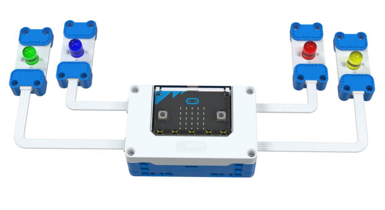
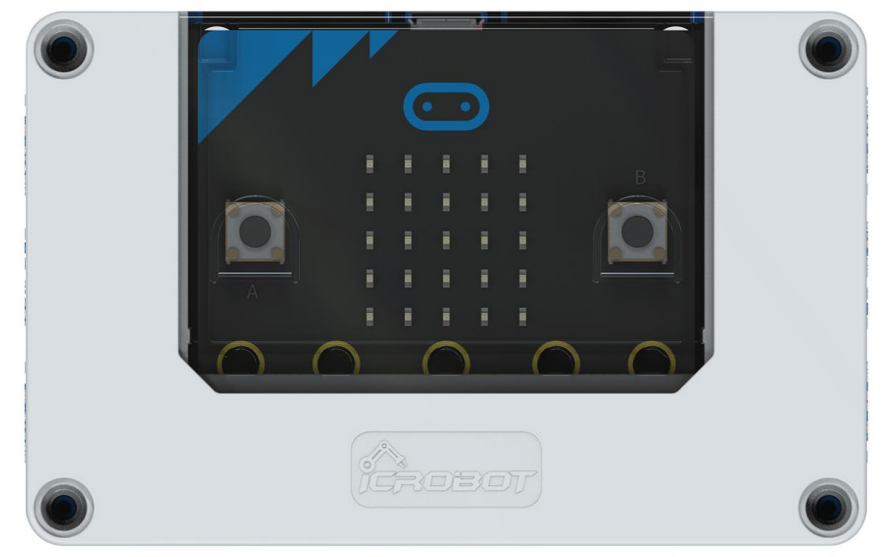
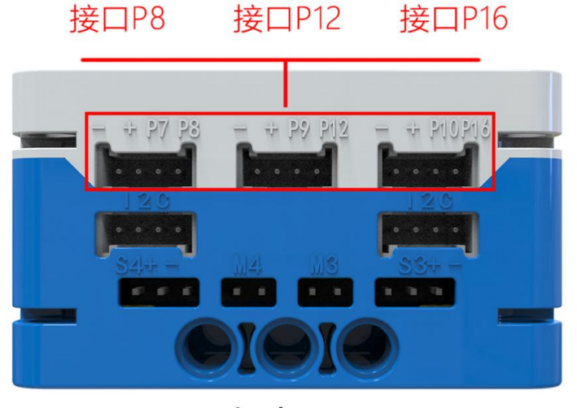
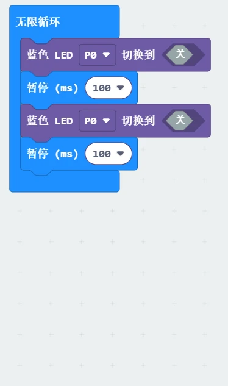

# LED Module
## Introduction  
The LED module is a basic lighting module. Based on the color of the LED, the module can be categorized into red, green, yellow, and blue LED modules. The only difference between these modules is the color of the LED, and their usage is identical.  

## Specifications
| Item | **Description** |
| :---: | :---: |
| Name | LED Module |
| Code | B0020036 (Green)   B0020037 (Blue)   B0020038 (Yellow)   B0020039 (Red)   |
| Voltage | 5V－DC |
| Dimensions  | 56×24×12 mm |
|  Control Signal   |  Digital Signal / Analog Signal   |
| Ports | Grove |

## **Usage**
|  | | |
| :---: | --- | --- |
|  |  |  |
| _Side View_ | _Front View_ | _Side View_ |
| ** LED Module Connection Diagram** | | |

The LED module can be connected to the micro:bit smart hub's interfaces: P0, P1, P2, P8, P12, and P16.  

## Modular Coding  

In the MakeCode coding software, by adding the micro:bit extension, you can program the LED module to blink.  

