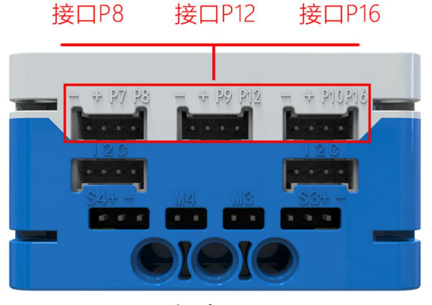

# Fan Module
## Introduction  
The fan module uses a DC motor to convert electrical energy into mechanical energy, driving the fan blades to rotate. This module can be used to design smart fans, heat dissipation systems, propellers, and other similar applications.  

## Specifications
| Item | **Description** |
| :---: | :---: |
| Name |  Fan Module   |
| Code | B0020015 |
|  Dimensions | 56×41×20mm |
| Voltage | 5V－DC |
|  Rated Current   | 200 mA |
|  Stall Current   | 1000 mA |
|  Maximum Torque   | 10 N·m |
|  Maximum Speed   | 10000 r/min |
|  Control Signal   |  Digital Signal / Analog Signal   |
| Ports | Grove |

## Usage  
|  | | |
| :---: | --- | --- |
|  |  |  |
| _Side View_ | _Front View_ | _Side View_ |
| ** Fan Module Connection Diagram** | | |

The fan module can be connected to the micro:bit smart hub's interfaces: P0, P1, P2, P8, P12, and P16.  

> **Note:** Avoid physical contact with the fan blades during operation to prevent mechanical injury.  
>

## Modular Coding  

In the MakeCode coding software, by adding the micro:bit extension, you can program the fan module to start or stop. By using the "plus" block, you can adjust the fan's speed.  

