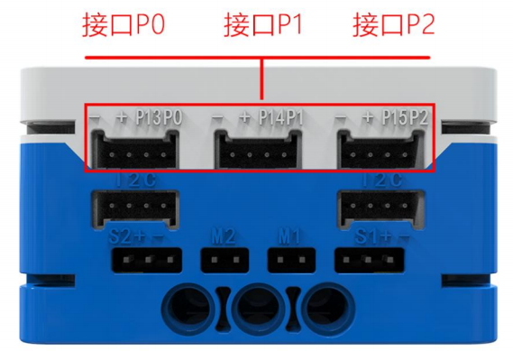

# Electromagnet Module
## Introduction  
An electromagnet is a device that generates magnetism when current flows through it. A conductive coil that matches the power of the core is wound around a magnetic core. When current flows through the coil, it generates a magnetic field, acting like a magnet. The magnetic field disappears when the power is turned off.

## Specifications  
| Item | **Description** |
| :---: | :---: |
| Name   |  Electromagnet Module   |
| Code   | B0020044 |
| Dimension | 28×24×12 mm |
|  Voltage   | 5V－DC |
|  Signal   |  Digital Signal / Analog Signal   |
|  Maximum Pulling Force   | 3KG |
| Ports | Grove |

## Usage  
|  | | |
| :---: | --- | --- |
|  |  |  |
| _Side View_ | _Front View_ | _Side View_ |
|  Electromagnet Module Connection Diagram   | | |

The electromagnet module can be connected to the micro:bit smart hub's interfaces: P0, P1, P2, P8, P12, and P16.  

> **Note:** The electromagnet module should not be powered on for more than 30s. It is normal for the module to generate heat during operation. If overheating occurs, stop using it to prevent burns.
>

---

## Modular Coding  

In the MakeCode coding software, by adding the micro:bit extension, you can program the electromagnet module as follows:

+ When button A is pressed, the electromagnet generates a magnetic field.
+ When button B is pressed, the electromagnet's magnetic field disappears.  
Additionally, you can adjust the electromagnet's magnetic force by using the "+" block.

