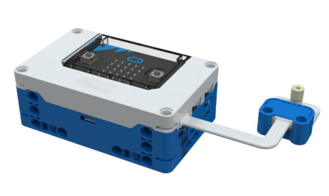
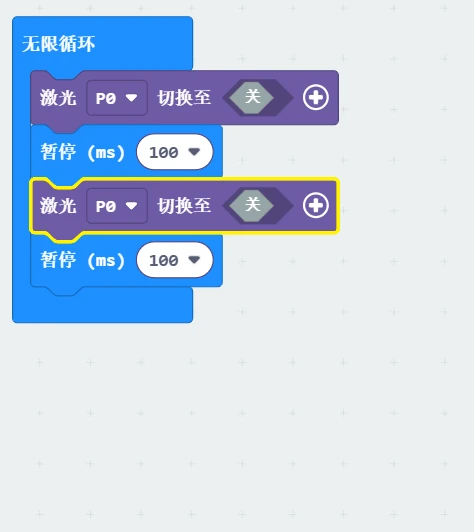

# Laser Module
## Introduction  
The core component of the laser module is a laser diode, which is a semiconductor device capable of directly converting electrical energy into laser light energy.  
Compared to traditional light sources, laser characteristics come from its unique emission and generation process: When current flows through the laser diode, electrons undergo transitions under specific conditions to release photons. These photons reflect within the medium, exciting more electron transitions, producing a light amplification effect, and forming a highly concentrated laser.  

## Specifications  
| Item | **Description** |
| :---: | :---: |
|  Name   | Laser Module   |
|  Code   | B0020004 |
| Dimension | 28×24×20 mm |
| Voltage | 5V－DC |
| Control Signal   | Digital Signal / Analog Signal   |
| Light Source Wavelength   | 650 nｍ |
| Ports | Grove |

## **Usage**

|  | | |
| :---: | --- | --- |
|  |  |  |
| _Side View_ | _Front View_ | _Side View_ |
| Laser Module Connection Diagram   | | |

The laser module can be connected to the micro:bit smart hub's interfaces: P0, P1, P2, P8, P12, and P16.  

When controlling the laser module with a digital signal, a high input voltage turns the laser module on, while a low input voltage turns it off.  
When controlling the laser module with an analog signal, the greater the input signal, the brighter the laser module; the smaller the input signal, the dimmer the LED light.  

> **Note:** Do not aim the laser at the eyes during use, as it may cause permanent eye damage!  
>

## Modular Coding  

In the MakeCode coding software, by adding the micro:bit extension, you can program the laser module to blink, and use the "+" block to adjust the laser's power.  

