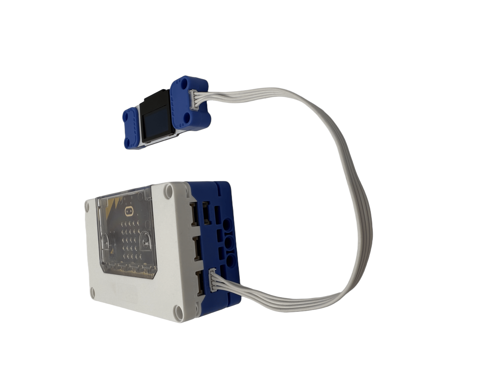
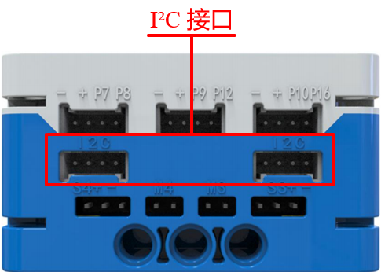
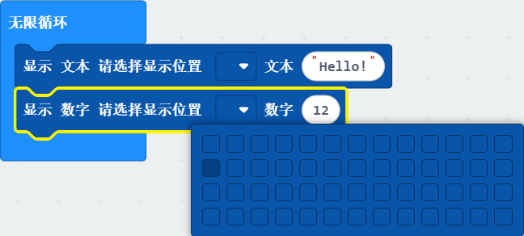
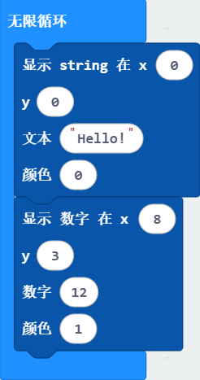

# OLED Module
## Introduction  
OLED (Organic Light Emitting Diode) displays use organic materials to emit light. Unlike traditional displays that require a backlight, OLED displays emit their own light, offering high brightness and contrast with low power consumption. The screen resolution is 128 pixels x 64 pixels, with a size of 0.96 inches. The driver chip is SSD1306. For use, it should be connected to the I²C port on the micro:bit smart hub for communication.  

## Specifications  
| Item | **Description** |
| :---: | :---: |
| Name | OLED Module |
| Code | B0020002 |
| Dimension | 72×24×12 mm |
| Voltage | 5V－DC |
|  Pixel Count   | 128×64 (Columns x Rows)   |
|  Control Signal   | I²C |
| I²C Address   | 60 |
|  Display Size   | 0.96 inches   |
| Ports | Grove |

# **Usage**

|   | | |
| :---: | --- | --- |
|  |  |  |
| _Side View_ | _Front View_ | _Side View_ |

**OLED Module Connection Diagram  **

The OLED module can be connected to any of the 4 I²C sensor communication interfaces on the micro:bit smart hub for coding and control. Through coding, you can first initialize the OLED screen and then control it to display text or numbers.  

# Modular Coding  

In the MakeCode coding software, by adding the micro:bit extension, the OLED display is divided into 4 rows and 13 columns. You can click to confirm the starting position for displaying strings or numbers. Then, you can input the text or numbers to display. In the example shown, the OLED display module is programmed to show the string "Hello" in the first row, first column, and the number 12 in the second row, first column.  

The OLED display is divided into 4 rows and 13 columns, with x values ranging from 0 to 12 corresponding to columns 1 through 13. Similarly, y values range from 0 to 3 corresponding to rows 1 through 4. You can then input the text or numbers to display. A color value of 0 shows the text with white background and black text, while a color value of 1 shows black background with white text.  

In the example, the OLED display module is programmed to show the string "Hello" with a white background and black text in the first row, first column, and the number "12" with black background and white text in the fourth row, ninth column.  

You can clear the OLED display screen using the "Clear" block.  

