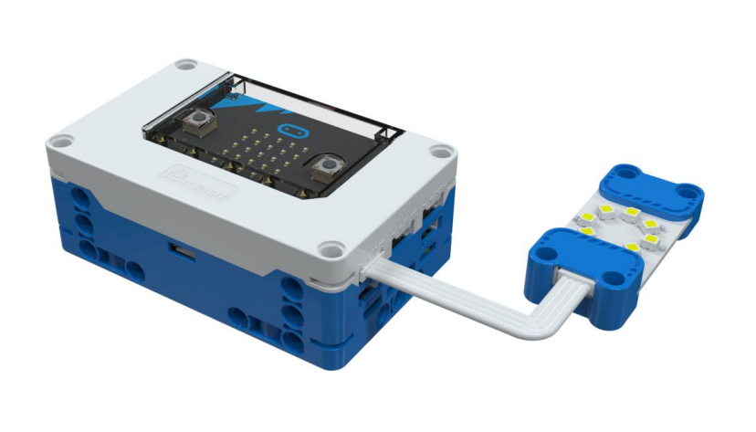
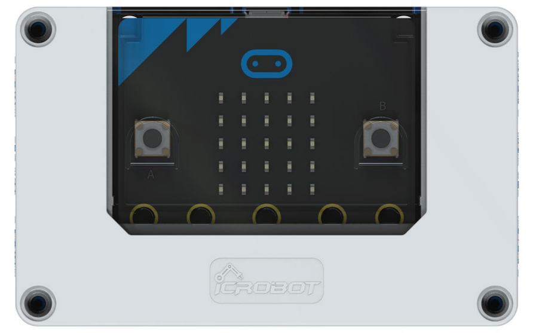
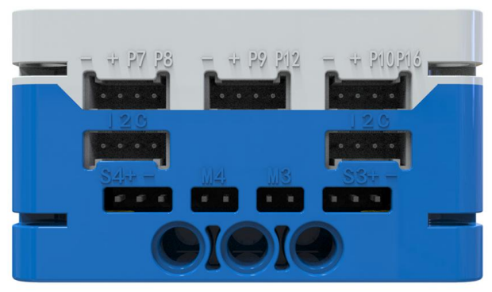
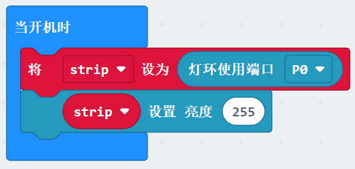
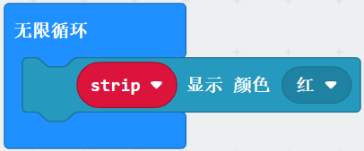
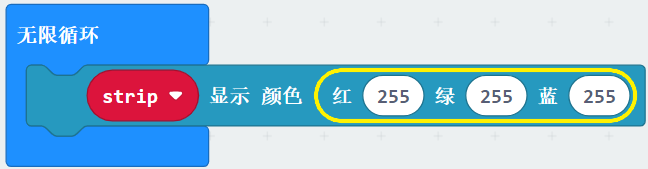
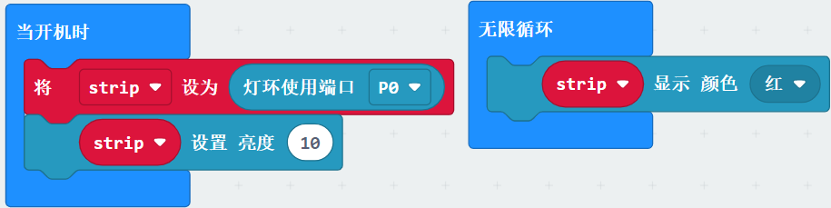

# RGB LED Module
## Introduction  
The RGB LED Module integrates 8 full-color LEDs and uses the WS2812 main control chip to achieve single-wire control. This design allows users to control all LEDs through a single signal pin, offering flexible manipulation. Additionally, by adjusting the RGB values precisely, users can display a wide range of vibrant colors. The brightness of the LED ring can be adjusted from 0 to 255, meeting various lighting needs.  

> **Note:** Due to the high brightness output of the RGB LED Module, avoid prolonged direct exposure to the light source to prevent eye damage.  
>

## Specifications  
| Item | **Description** |
| :---: | :---: |
|  Name   |  RGB LED Module   |
| Code | B0020041 |
| Dimension | 56×24×12 mm |
| Voltage | 5V－DC |
| Control Signal   | Digital Signal   |
|  Number of LEDs   | 8  LEDs   |
| Ports | Grove |

## Usage  

|  |  |  |
| :---: | :---: | :---: |
| _Side View_ | _Front View_ | _Side View_ |
|  RGB LED Module Connection Diagram   | | |

The RGB LED Module can be connected to the micro:bit smart hub’s regular sensor interfaces: P0, P1, P2, P8, P12, and P16 for coding control.  

## Modular Coding  

To use the RGB LED Module, first initialize the port. Here, "strip" is the initial variable. Different variables can be set to correspond to different RGB LED modules on different ports. You can also adjust the corresponding brightness of the LED ring (0~255).  

This module has ten preset colors: Red, Orange, Yellow, Green, Blue, Indigo, Violet, Purple, Black, and White. You can input the corresponding RGB values to display the desired color on the LED ring.  

You can input the corresponding RGB values to display the desired color on the LED ring.  

In the MakeCode coding software, by adding the micro:bit extension, you can program the RGB LED Module to display red, as shown in the example program.  

