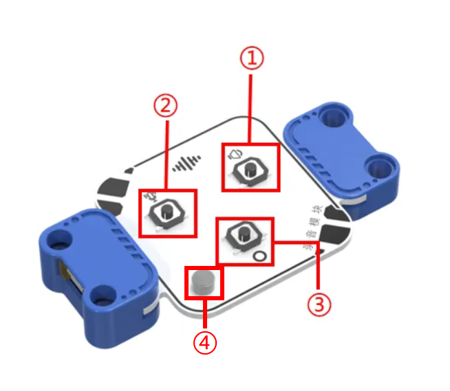

# Recording Module
## Introduction  
The Recording Module is mainly used to capture sound signals from the surrounding environment and convert them into digital signals for storage, allowing for later playback or transmission. It functions as a core component of a small recording device, capable of recording voices, music, environmental sound effects, and more. This module also comes with 5 built-in sound samples, making it easy to create projects.  

## Specifications  
| Item | Specification   |
| :---: | :---: |
| Name | Recording Module |
| Code | B0020030 |
| Dimension | 66×40×12 mm |
| Voltage | 5V－DC |
| Control Signal   | I²C |
| Ports | Grove |

## **Usage**

| No.   | Item |  Function   |
| :---: | :---: | :---: |
| ① | Play  |  Plays the currently selected sound effect   |
| ② |    Record   |  Press and hold to start recording   |
| ③ | Switch Button   | Switches to select sound effects   |
| ④ |  Microphone   |  Captures sound   |

Connect the recording module to any Grove Cable on the micro:bit smart hub. The recording module is equipped with internal storage space to store 5 built-in sound effects. By using the record button, users can easily record an audio clip of up to 30 seconds. Even when powered only by the hub, users can operate the module to record and play sounds with the press of a button.  

**5 Built-in Sound Effects**: Machine gun fire, laser firing, racing acceleration, war start, countdown.  

| ![]img/RM02.png) | | |
| :---: | --- | --- |
|  |  |  |
| _Side View_ | _Front View_ | _Side View_ |
|  Recording Module Connection Diagram   | | |

The recording module can be connected to the micro:bit smart hub via the I²C interface and controlled through coding.  

## Modular Coding  

In the MakeCode coding software, by adding the micro:bit extension, you can program the recording module to play the machine gun sound effect when button A is pressed.  

