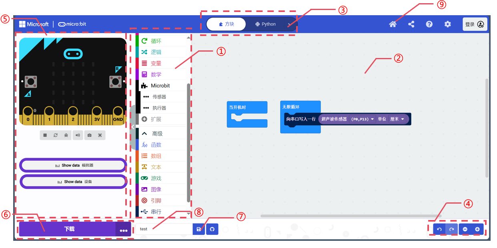
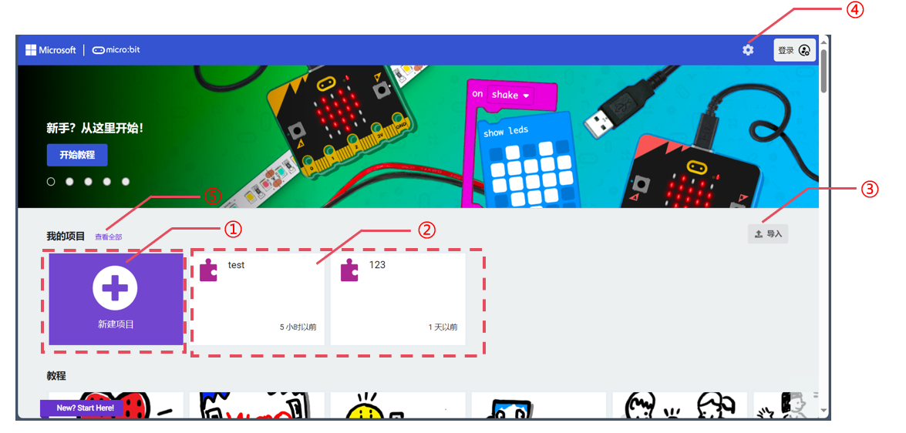

_**For basic usage of the software, please refer to the **_[**Quick Start**](about:blank)** Guide**_**.  **_
# Software Introduction
## MakeCode Interface Functions  
### Coding Interface  

|  No.   | Name   | Description   |
| :---: | :---: | :---: |
| ① | Code Block Area   | The code blocks required for coding are in this area.   |
| ② | Coding Area   | Drag and drop the code blocks into this area to program.   |
| ③ | Code Type Switch Area   |  Switch between different types of code display. The default is block code. On the right side, options include Python and JavaScript.   |
| ④ | Interface Operation Area   | The four options here are: Undo, Redo, Zoom Out, and Zoom In.   |
| ⑤ | Debugging Area   | Simulate and debug the code in this area, view serial data and hub status.   |
| ⑥ | Download   |  Click the download button to transfer the program to the hub.   |
| ⑦ | Save   | Click the save button to save the code to your computer.   |
| ⑧ | Project Name   | Displays the current project name, which can be renamed.   |
| ⑨ | Home   |  Click the home button to return to the home page.   |

> After clicking the home button in section ⑨, you can access the project management and tutorial-related pages.  
>

****

### Project Management and Tutorial Interface  

| No.   | Item | Description   |
| :---: | :---: | --- |
| ① | New Project   | Click the new project button to create a new project.   |
| ② |  Historical Projects   | All saved historical projects are displayed here.   |
| ③ | Import Project   |  Click the import button to import external projects.   |
| ④ | Settings   | Click the settings button to configure the software settings.   |
| ⑤ | View All   | If there are projects not displayed in area ②, click this button to view all projects.   |

