# Modular Coding
## Modular Coding Interface  
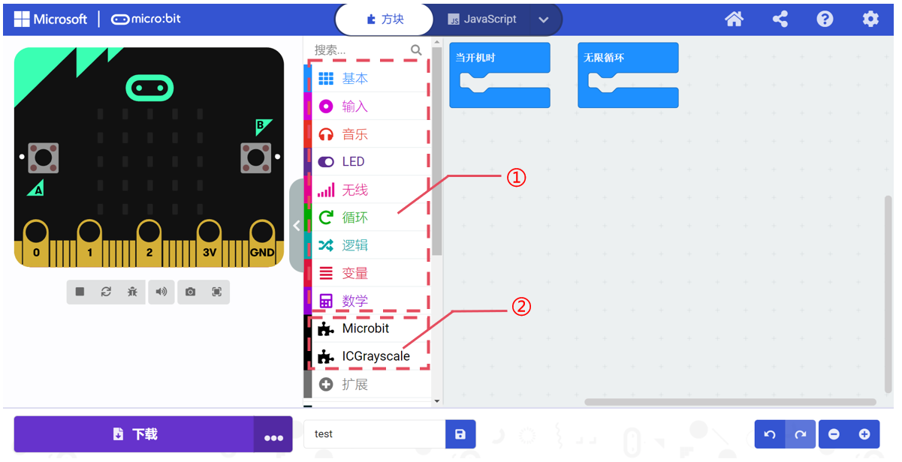

| No.   | Item |  Description   |
| :---: | :---: | :---: |
| ① | Basic Blocks   | Blocks provided by MakeCode itself   |
| ② | Imported Extensions   | Driver blocks provided for peripheral modules.   |

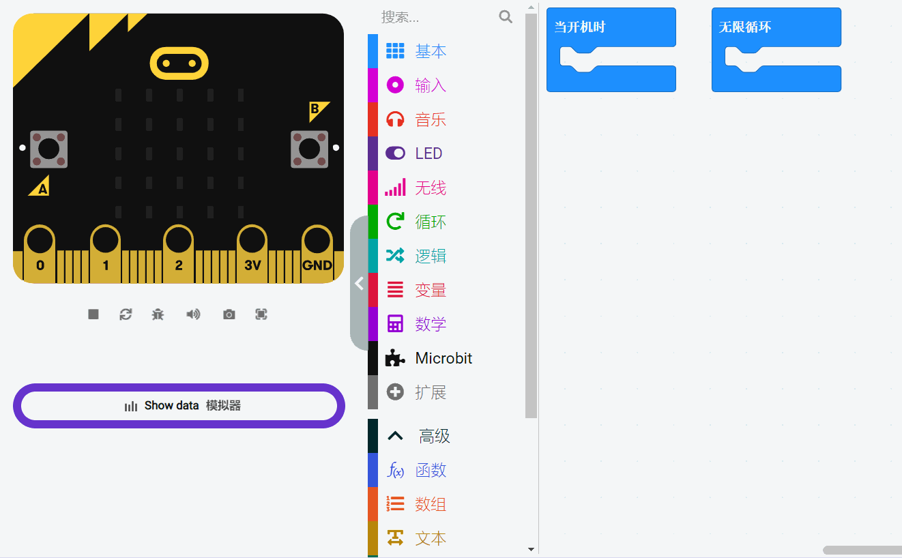

This extension includes two main categories: "Sensors" and "Actuators." Depending on the peripheral module’s attributes, you should use the appropriate block under the corresponding category. For example, to use the potentiometer module, which belongs to sensors, you need to find the corresponding block under the sensor category. 

For information on importing extensions, refer to the [Quick Start](https://www.yuque.com/alexzhao-gaou9/icreaterobot/teyh2zhi7yg2y1yy) guide.  

### Sensor Modules  
The table below details the output type and data type parameters for the extended sensors in the micro:bit kit.  

|  Code Block   | Output Type / Data Type   |
| :---: | :---: |
|  Long-distance Photoelectric   |  Voltage / Analog   |
|  Potentiometer Module   |  Voltage / Analog   |
|  Grayscale Sensor   |  Voltage / Analog   |
| Photosensitive Sensor |  Voltage / Analog   |
|  Flame Sensor   |  Voltage / Analog   |
|  Joystick Module   |  Voltage / Analog   |
|  Water Level Sensor   |  Voltage / Analog   |
| MQ-2 Gas Sensor |  Voltage / Analog   |
|  Soil Moisture Sensor   |  Voltage / Analog   |
| Temperature Sensor |  Voltage / Analog   |
| PIR Sensor |  Level / Digital   |
| Hall Sensor |  Level / Digital   |
| Button Sensor |  Level / Digital   |
| Ultrasonic Sensor | / |

### Actuator Modules  
The table below details the drive type and data type parameters for the extended actuators in the micro:bit kit.  

|  Code Block   | Drive Type / Data Type   |
| :---: | :---: |
| Yellow LED Module   |  Level / Digital   |
| Blue LED Module   |  Level / Digital  |
| Green LED Module   | Level / Digital  |
| Red LED Module   | Level / Digital  |
| Laser Module   | Level / Digital  |
| Electromagnet Module   | Level / Digital  |
| Fan Module   | PWM |
| DC Motor | PWM |
|  OLED Module   | I²C |
|  Servo Motor   | I²C |
| Recording Module   | I²C |
| Geek Servo | PWM |
| RGB LED Module | WS2812 |

### Writing Code Blocks  
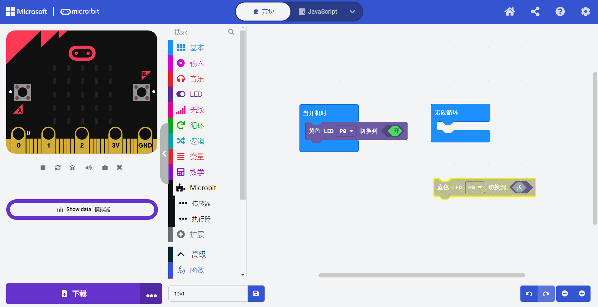

Code blocks need to be placed in the coding area as required. Blocks that are not placed correctly will be highlighted in yellow. Yellow-highlighted blocks will not be included in the program and will not affect the program's execution.  

### Port Selection  
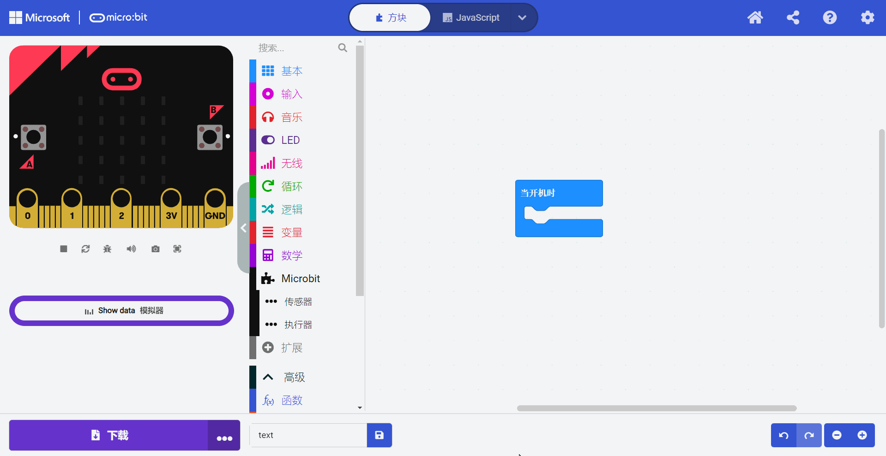

Click on the port after the code block to select the port and connect the corresponding port on the hub to the device. The available ports vary for each code block. Ensure that the device is connected to the correct port as selected in the code, as connecting to other ports may cause anomalies.  

> **Note**: Make sure to connect the device to the correct port on the hub. Incorrect or loose connections may result in the program not functioning as expected.
>

### Logic Judgment for Code Blocks  
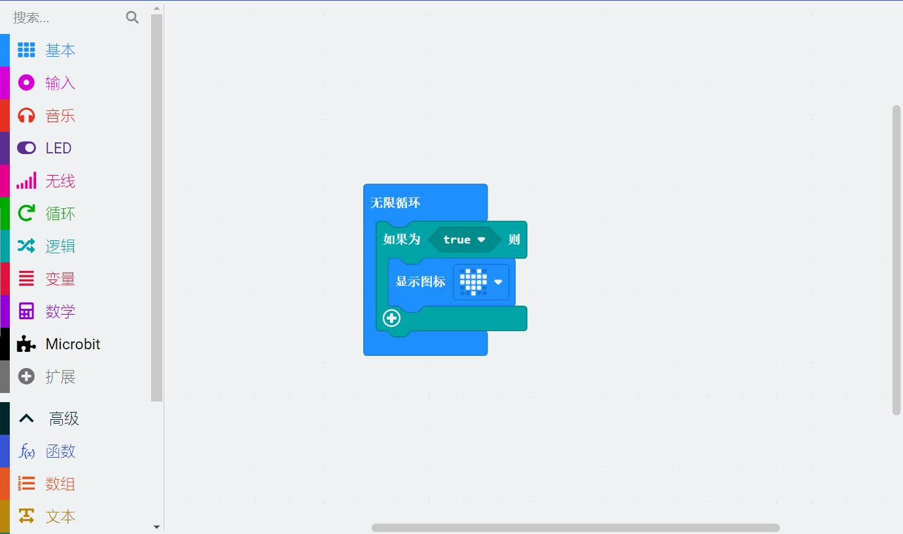

Hexagonal blocks like the "Joystick Detected" block can be used for logical judgment with statements like "If...". When the condition of the block is met (e.g., the joystick is pushed up), it will return true and execute the code after "Then."  

### Setting Values for Code Blocks  
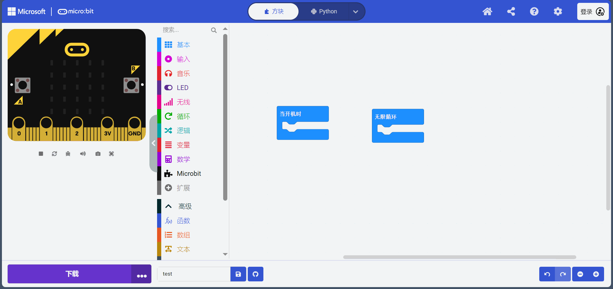

Code blocks with an oval white input box allow you to input numbers directly or set variables to fill in the input box. The values in the input box are unrestricted, but you should input the correct range of numbers according to the module's usage rules. Otherwise, the module may operate abnormally.  

### Special Code Blocks  
#### RGB Block  
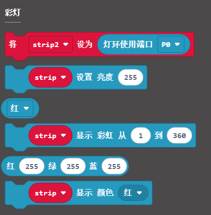

After dragging out the RGB light block, the system will automatically create a variable called “strip.” Any adjustments to the RGB lights will need to reference this specific variable.  

> **Note**: The RGB light module can only adjust all lights uniformly and cannot set individual lights’ colors.  
>

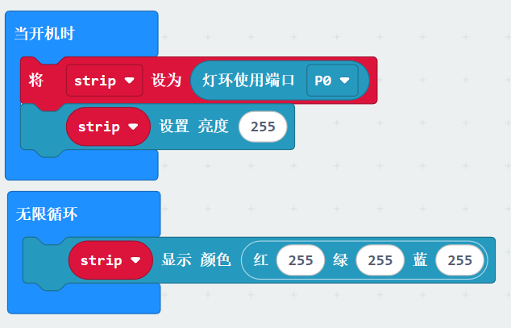

In the provided code example, during the initialization phase when the program starts, it first configures the connection port and brightness settings for the RGB light; then, in an infinite loop, the program sets the RGB color of the light to white, meaning that the brightness values for red, green, and blue are all set to 255.  

#### Wireless Block  

| | Wireless Control Blocks   | | |
| --- | :---: | --- | --- |
| Block   |  | 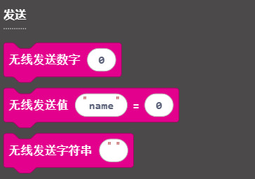 | 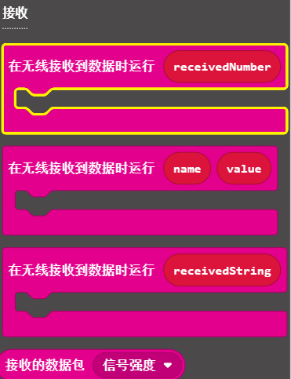 |
| Description   | Set Group Block   | Send Information Block   | Receive Information Block   |

Wireless control uses 2.4G as the communication medium, enabling wireless communication and control between multiple hubs. First, set the same group (communication channel) for the hubs. The hubs in the same group can send and receive information using the "Send Information Block" and "Receive Information Block."  

|  Code   | 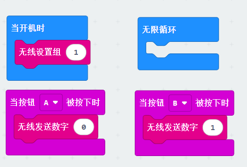 | 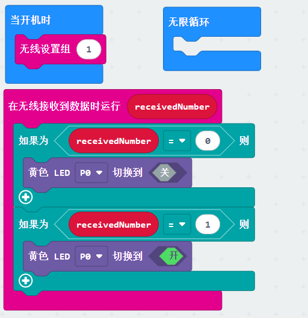 |
| :---: | :---: | :---: |
| Sender/ Receiver   | Sender   | Receiver   |

At startup, the sender and receiver are set to the same group (in example, set to 1).

**Sender**: When button "A" is pressed, send the number "0." When button "B" is pressed, send the number "1."  

**Receiver**: First, receive the data and then identify it. If the received data is "0," turn off the "Yellow LED." If the data is "1," turn on the "Yellow LED."  

## Advanced Block  
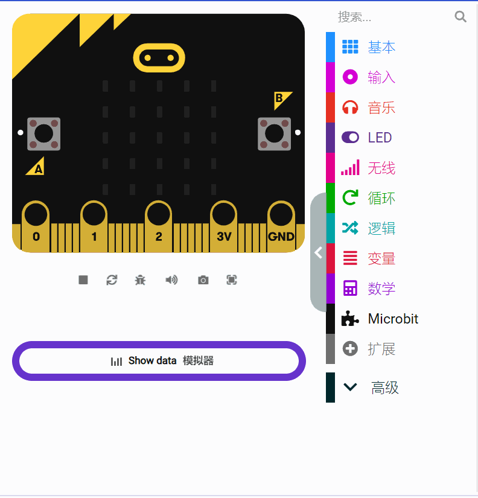

### Serial  
Serial is often used to read module measurement values and display them as line charts. It can also be used for debugging programs by sending information to the computer to indicate a specific action has been executed after certain conditions are met.  

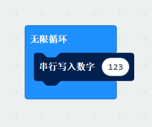

In the example above, the first serial write sends the string "123" to the computer, while the second serial write sends the light sensor value to the computer.  

When sending only the light sensor value, click "Show Data Device" on the left to view the waveform. The waveform changes as the light sensor is blocked.  

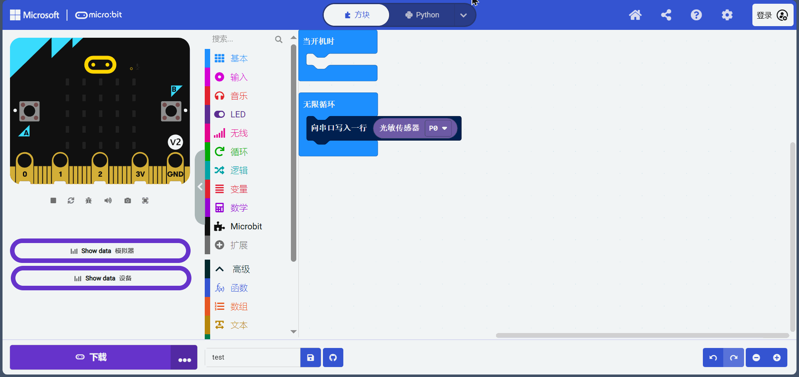

## Other Blocks
For other blocks not mentioned above, please refer to the feature introduction section.  

