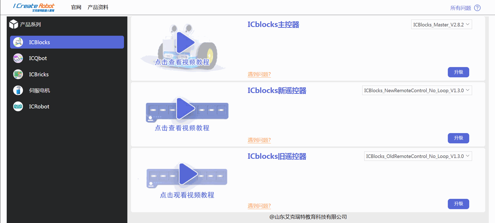
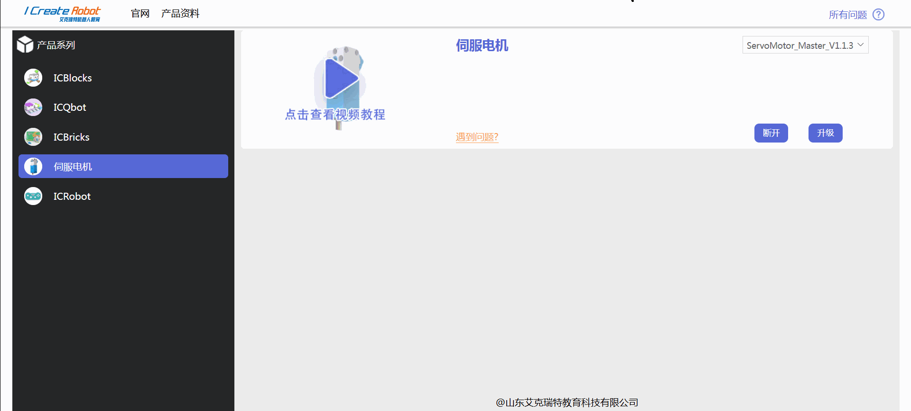

# Firmware Upgrade
## Servo Motor Upgrade Method  
 Firmware Upgrade Center：[https://update.icrobot.cn/](https://update.icrobot.cn/)

|  |  |
| --- | --- |
| 1. Prepare 1 **ICLink 2.0**, set the SWD switch to the right, and the forward/reverse switch to the left.   | 2. Use the Grove Cable to connect the servo motor to the J1 port on the ICLink 2.0, then connect the ICLink 2.0 to the computer.   |
|  | ) |
| 3. Press and hold the center button of the motor while simultaneously pressing the reset button on the  ICLink 2.0. The motor indicator light will change to a rainbow mode.   | 4. Open the firmware upgrade center, select the servo motor module, and then choose the firmware version to upgrade.   |
|  |  |
| 5. Click "Connect," select the motor's serial port, and once the connection is successful, close it.   | 6. Click "Upgrade" and wait for the progress bar to complete.   |

