# Editor Overview
##  Interface Overview  
Click the [micro:bit Python Editor](https://python.microbit.org/v/3/project) link to open the online editor. The interface displayed upon first access is shown below:

<!-- 这是一张图片，ocr 内容为： -->
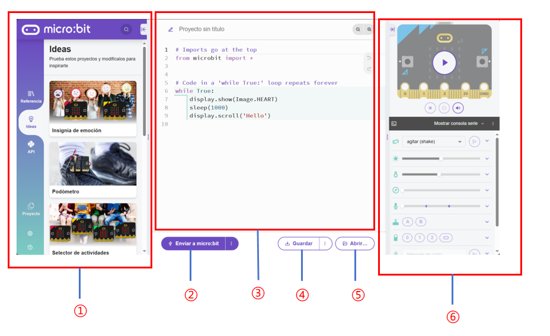

| NO. | Name | Function |
| --- | --- | --- |
| ① |  Function Options Area   | Provides project management functions.   |
| ② |  Send Code   | Sends the script to the connected micro:bit.   |
| ③ |  Code Editor   | Edit user code.   |
| ④ |  Save   | Saves the project as a HEX file to the computer.   |
| ⑤ |  Open   | Opens a local file.   |
| ⑥ |  Status Display Area   | Displays the status of the micro:bit.   |


** Language Settings  **

Step 1: Click the gear icon in the lower-left corner, then click the Language button.

<!-- 这是一张图片，ocr 内容为： -->
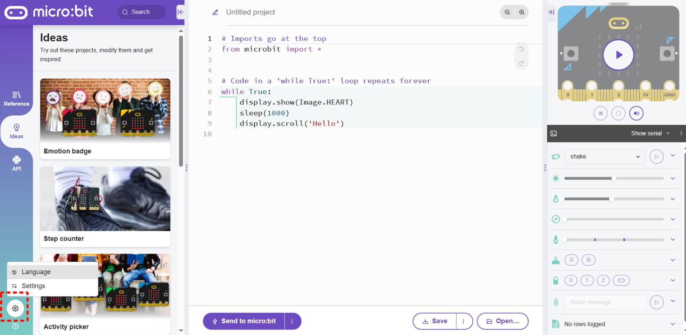


Step 2: Select the desired language in the pop-up window.

<!-- 这是一张图片，ocr 内容为： -->
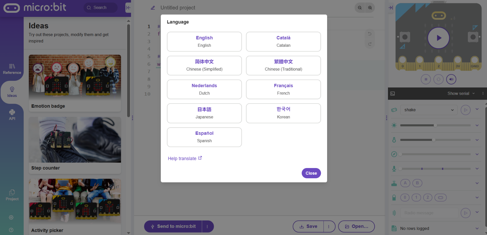_**<font style="color:#DF2A3F;">  
</font>**__Note: It is recommended to use micro V2.0 or later. Earlier versions have limited memory, which may prevent the software from functioning properly._

_**<font style="color:#DF2A3F;"></font>**_

##  Quick Start  
###  Usage Notes  
+  Due to memory limitations, not all library files can be imported directly.  
+  During use, import the required libraries according to the actual application requirements. To optimize memory usage, remove any unused libraries from the project in a timely manner.  


[ai_camera github](https://github.com/cyc36880/microbit_micropython_k210.git)


 When using the libraries, at least the following files must be imported:  

`color.py`、`DC_motor.py`、`iic_base.py`

 These files provide the basic functionality required by other device driver libraries. The related device drivers will not function properly without these files.  


###  File Import  
###  Adding a Single File  
**Step 1:** Click the   button on the lower-left or lower-right side.

<!-- 这是一张图片，ocr 内容为： -->
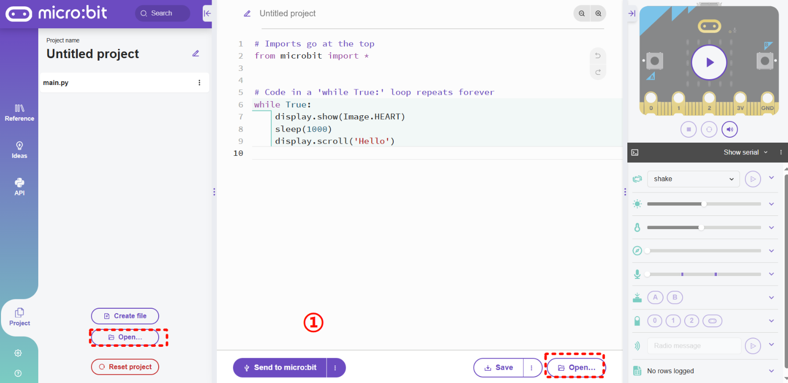


**Step 2: **Select the file you want to import, then click Open.

<!-- 这是一张图片，ocr 内容为： -->
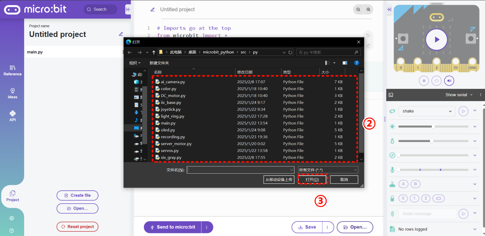


**Step 3:** In the pop-up dialog box, select the second option, then click OK.

<!-- 这是一张图片，ocr 内容为： -->
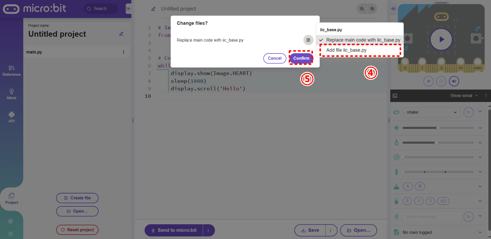


**Step 4:** A notification indicating that the file has been added successfully will appear at the top. The added file will also appear in the project list on the left, indicating that the file has been added successfully.

<!-- 这是一张图片，ocr 内容为： -->
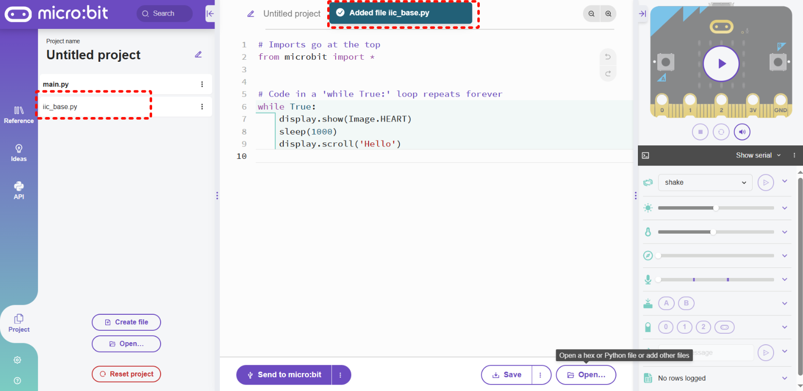

###  Adding Multiple Files  
Adding multiple files is similar to adding a single file. Refer to the animation below for details.  

<!-- 这是一张图片，ocr 内容为： -->
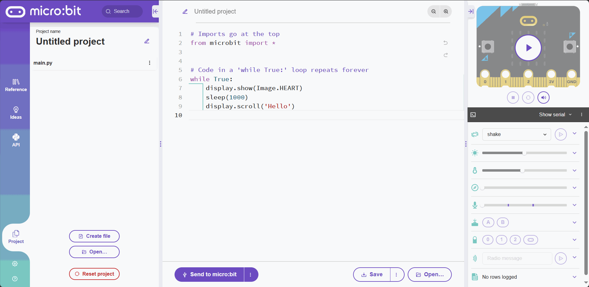

###  Device Connection  
**Step 1:** Use a micro cable to connect the hub to the computer.

<!-- 这是一张图片，ocr 内容为： -->
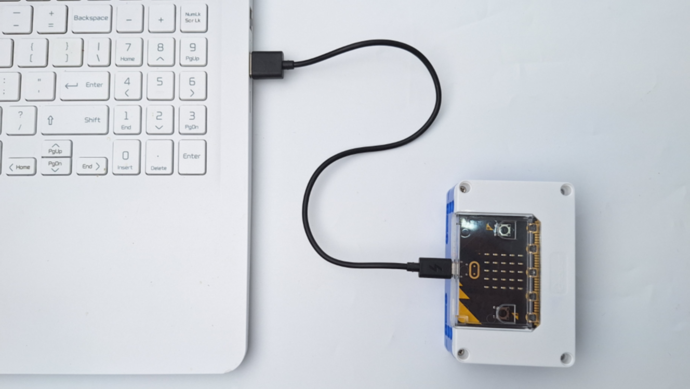


**Step 2:** Use a Grove cable to connect the micro to the vision module.

<!-- 这是一张图片，ocr 内容为： -->
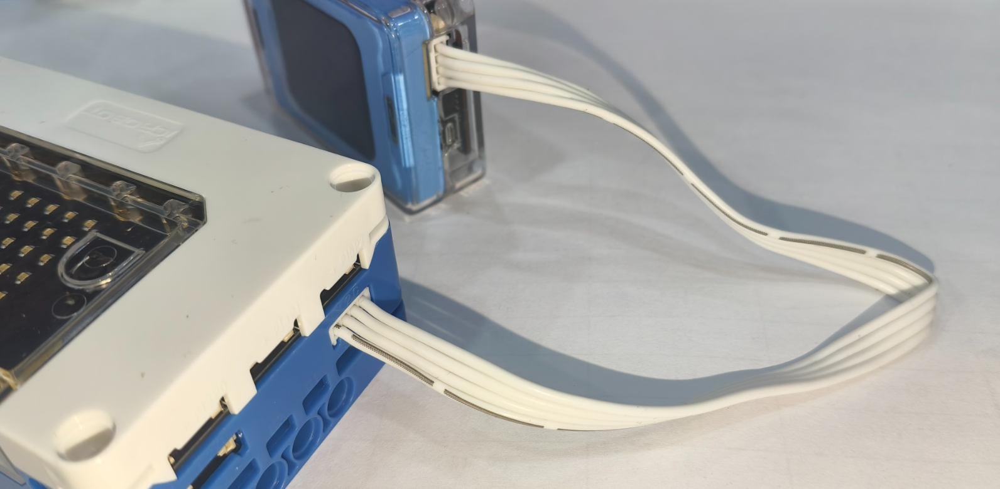


###  Downloading the Script  
<!-- 这是一张图片，ocr 内容为： -->
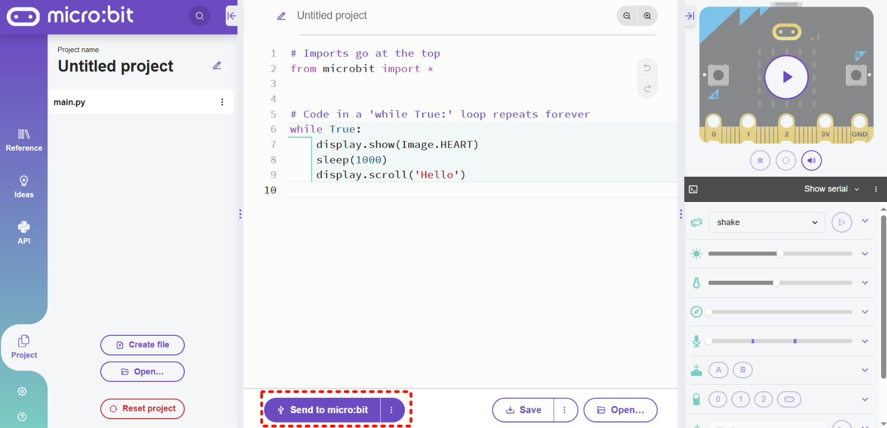


** Download the Program  **

Make sure that the micro is connected to the computer. Using the default code displayed when you first open the website, click the button highlighted by the red box to download the code to the controller.

> The first script download may take longer because the firmware may need to be flashed. Subsequent downloads will be significantly faster.  
>


** The default program produces the following result:  **

<!-- 这是一张图片，ocr 内容为： -->


Display a heart icon, then scroll **“Hello”** after one second. Repeat this sequence continuously.

```python
from microbit import *

import server_motor # Import Library (File Name)

m1 = server_motor.motor(addr = server_motor.LIGHT_RED) # Create a Device Object

while True:
    m1.run(20) # Using the Object
```

 The above is an example of how to use a servo motor.  


+ **Line 1: **`from microbit import *`imports the `microbit` library. Without this library, library functions such as `sleep` cannot be used.
+ **Line 3:**  The `server_motor` library is imported using `import`.
+ **Line 5: ** A device object is created. All subsequent operations on the corresponding device must be performed through this object.  
+ **Line 8 : **The object is used to control the device.

 All device drivers are used in a similar manner.  


##  Example  
###  Six-Channel Grayscale Sensor  
Following the library import procedure, in addition to the required libraries, import the `six_gray.py` library. The project files are shown below:

<!-- 这是一张图片，ocr 内容为： -->
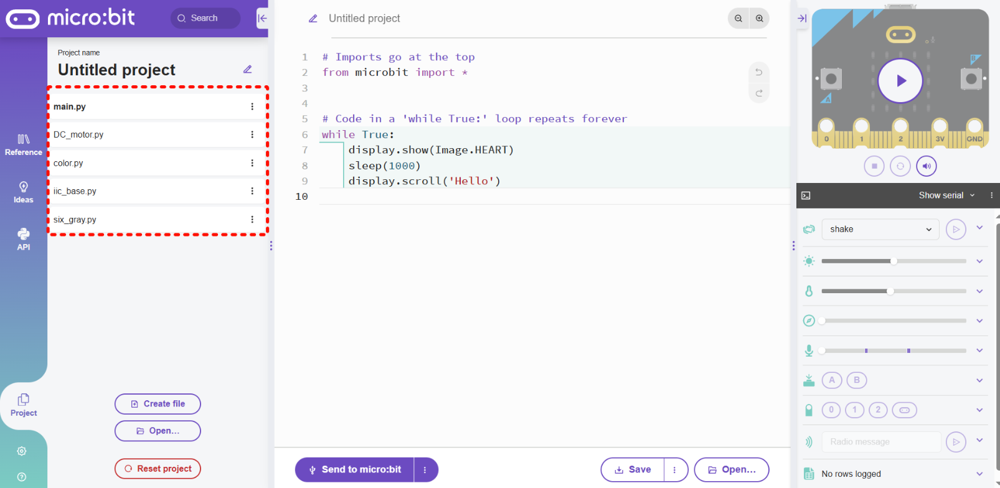


 Use a Grove cable to connect the micro to the six-channel grayscale module.

<!-- 这是一张图片，ocr 内容为： -->
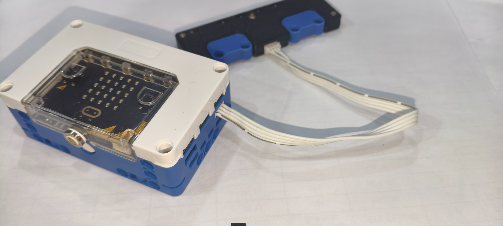


Enter the following code in the code editor, then download it to the micro to view the result.

```python
from microbit import *

import six_gray # Import the Six-Channel Grayscale Library

sg = six_gray.six_gray_sensor() # Create the Module Object

while True:
    print(sg.gray()) # Print the Six-Channel Grayscale Values
    sleep(500)
```

<!-- 这是一张图片，ocr 内容为： -->


### OLED
Following the library import procedure, in addition to the required libraries, import the `oled.py` library. The project files are shown below.

<!-- 这是一张图片，ocr 内容为： -->
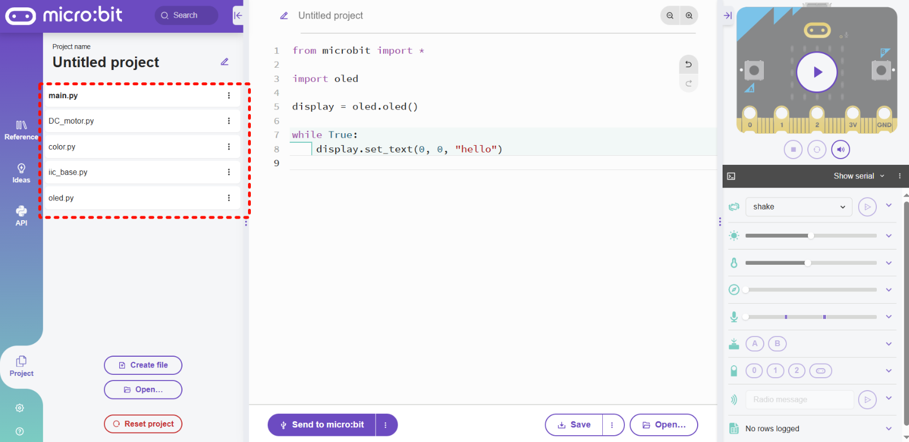

```python
from microbit import *

import oled  # Import the OLED Library

display = oled.oled()  # Create the Module Object

count=0
while True:
    count+=1
    if count>20:
        count=0
    display.set_text(0, 0, "hello %d  " % (count)) # Display a String
    sleep(400)

```

<!-- 这是一张图片，ocr 内容为： -->
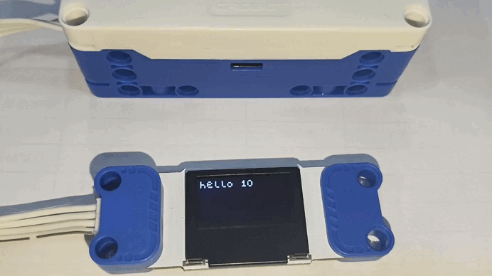


_***  **__For information on how to use other devices, please refer to the API documentation and explore the available functions as needed.  _

## Introduction to the micro Python Library
This library contains drivers for various devices. By leveraging the features of the Python programming language, it enables the development of code with greater flexibility, broader application scenarios, and improved maintainability.  


 The library contains the following files:  

| File | Function |
| :---: | :---: |
| color.py |  Color definitions   |
| ai_camera.py |  AI camera library   |
| DC_motor.py |  DC motor library   |
| iic_base.py |  IIC driver library   |
| joystick.py |  Joystick library   |
| light_ring.py |  LED ring library   |
| oled.py |  OLED library   |
| recording.py |  Audio recording module library   |
| server_motor.py |  Servo motor library   |
| servors.py |  Servo library   |
| six_gray.py |  Six-channel grayscale library   |
| ultrasonic.py |  Ultrasonic sensor library   |


