# ai_camera
The API is used to control the vision module. Communication with the vision module requires the use of a specified communication protocol and data processing. By using the API, low-level operations are abstracted, simplifying the overall usage process.  


##  Usage Notes  
+ For the tags used with the vision module, you can generate them using the [Tag Online Generator](https://chaitanyantr.github.io/apriltag.html). The vision module uses the `TAG36H11` tag family. Select `**TAG36H11**` under **Tag Family**, and enter the desired value under **Tag ID**. The recommended range is generally **0–200**.
+ To generate a QR code, visit [QR Code Generator](https://cli.im/), enter the desired text, and click the **Generate QR Code** button.


##  Required Library Files  
`color.py`、`iic_base.py`、`ai_camera.py`


##  Parameter Macros  
```python
AI_CAMERA_SYS     # system
AI_CAMERA_COLOR   # color detection
AI_CAMERA_PATCH   # color block tracking
AI_CAMERA_TAG     # tag recognition
AI_CAMERA_LINE    # line detection
AI_CAMERA_20_CLASS# 20-class object recognition
AI_CAMERA_QRCODE  # QR code recognition
AI_CAMERA_FACE_ATTRIBUTE # facial attribute recognition
AI_CAMERA_FACE_RE # Face Recognition
AI_CAMERA_DEEP_LEARN # Deep Learning
AI_CAMERA_CARD # Card Recognition
```

These macros are used to switch between vision module modes and to read or write data for the specified mode.  

## Class ai_camera
The `ai_camera` object is the basic object used to operate the AI vision module.


###  Constructor  
```python
class ai_camera.ai_camera(port=0, addr=0x24)
```

Create an AI camera object from the files in `ai_camera`.


** Parameters  **

+ **port**: Used to select the port. This parameter has no practical significance in micro and does not need to be configured. It is retained for compatibility.
+ **addr**: Sets the device address. The AI vision module has only one address, so the default address can be used.


###  Function  
#### set_sys_mode
+ set_sys_mode(mode)

**Set the Module Mode**


**parameters：**

+ mode   Set Mode  
    -  Refer to `Parameter Macros`


** Usage Example  ：**

```python
from microbit import *
import ai_camera # Import the Vision Module Library
ai_camera_handle = ai_camera.ai_camera() # Create the Vision Module Handle
ai_camera_handle.set_sys_mode(ai_camera.AI_CAMERA_PATCH) # Set the Color Block Tracking Mode
while True:
    pass
```

<!-- 这是一张图片，ocr 内容为： -->
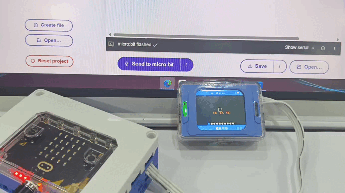

After the script is uploaded, the operating mode of the vision module switches from Color Recognition Mode to Color Block Tracking Mode.


#### get_sys_mode
+ get_sys_mode()

 Get the Current Device Mode  


**Return Value ：**

AI_CAMERA_COLOR ~ AI_CAMERA_CARD

> Returns the current mode type. Use the `Parameter Macros` to compare the returned value.
>


** Usage Example  ：**

```python
from microbit import *
import ai_camera # Import the Vision Module Library
ai_camera_handle = ai_camera.ai_camera() # Create the Vision Module Handle
while True:
    get_mode = ai_camera_handle.get_sys_mode() # Get the System Mode
    if get_mode == ai_camera.AI_CAMERA_TAG:
        print("处于Tag Recognition模式")
    elif get_mode==ai_camera.AI_CAMERA_FACE_DE: 
        print("处于Face Detection模式")
    else:
        print("其它模式")
    sleep(400)
```

<!-- 这是一张图片，ocr 内容为： -->
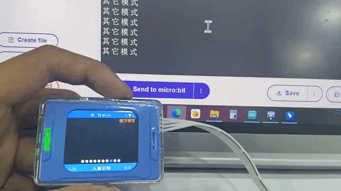

Switch Modes Using the Dial，When switching to Tag Recognition Mode or Face Detection Mode using the dial, the corresponding mode name is printed through the serial port.


#### get_color_rgb
+ get_color_rgb()

 Get the RGB Values for Color Recognition  


** Return Value  ：**

rbg value

>  Format:   （r, g, b）            For example:  （255, 0, 0）
>


** Usage Example  ：**

```python
from microbit import *
import ai_camera # Import the Vision Module Library
ai_camera_handle = ai_camera.ai_camera() # Create the Vision Module Handle
ai_camera_handle.set_sys_mode(ai_camera.AI_CAMERA_COLOR) # Set the Color Recognition Mode
while True:
    print(ai_camera_handle.get_color_rgb()) # Print the Retrieved RGB Values
    sleep(400)
```

<!-- 这是一张图片，ocr 内容为： -->
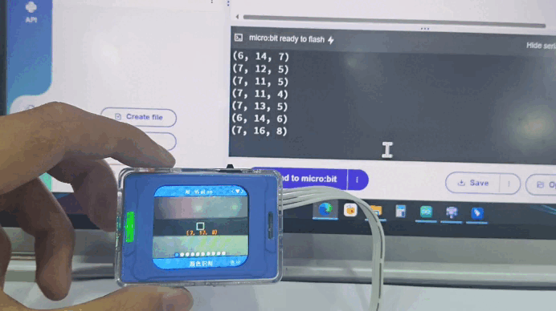

At the center of the vision module, there is a white box that indicates the color sampling area. The RGB values detected are displayed below the white box. These values are consistent with those printed through the serial port.  


#### set_find_color
+ set_find_color(color)

 Set the Color for Color Block Tracking  

**Parameters：**

+ color    Set the Tracking Color  
    - WHITE 
    - BLACK 
    - RED    
    - YELLOW 
    - GREEN   
    - BLUE    


** Usage Example  ：**

```python
from microbit import *
import color # Import the Color Library
import ai_camera # Import the Vision Module Library
ai_camera_handle = ai_camera.ai_camera() # Create the Vision Module Handle
ai_camera_handle.set_sys_mode(ai_camera.AI_CAMERA_PATCH) # Set the Color Block Tracking Mode
ai_camera_handle.set_find_color(color.RED) # Set the Tracking Color to Red
while True:
    pass
```

<!-- 这是一张图片，ocr 内容为： -->
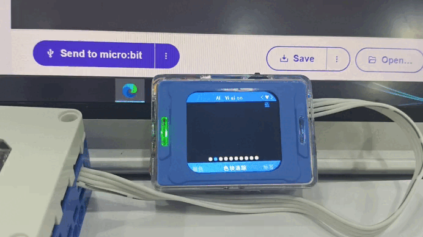

The upper-right corner of the vision module displays the color currently selected for color block tracking as blue. After the script is uploaded, the tracking color switches to red.  


#### face_study
+ face_study()

 Learn a Face for Face Recognition  

>  The face recognition learning function is effective only when a face is detected. If no face is detected, this command has no effect.  
>
> After learning is completed, an ID is automatically assigned to the current face. The ID range is **0–3**. When more than four faces have been learned, the IDs are overwritten starting from **0**.
>


**Usage Example：**

```python
from microbit import *
import ai_camera # Import the Vision Module Library
ai_camera_handle = ai_camera.ai_camera() # Create the Vision Module Handle
ai_camera_handle.set_sys_mode(ai_camera.AI_CAMERA_FACE_RE) # Set the Face Recognition Mode
sleep(1000) # Wait for the Mode Switch to Complete
ai_camera_handle.face_study() # Face Learning
while True:
    pass
```

<!-- 这是一张图片，ocr 内容为： -->
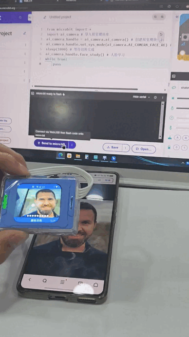

When a face is detected by the vision module, upload the script. The vision module will learn the detected face. The white box around the face will change to an orange box, and an ID will be assigned to the face.  

**<font style="color:rgb(118, 131, 144);background-color:rgb(34, 39, 46);"></font>**

#### deep_learn_study
+ deep_learn_study()

 Learn an Image for Deep Learning  

> After learning is completed, an ID is automatically assigned to the current deep learning image. The ID range is **0–3**. When more than four images have been learned, the IDs are overwritten starting from **0**.
>

**Usage Example：**

```python
from microbit import *
import ai_camera # Import the Vision Module Library
ai_camera_handle = ai_camera.ai_camera() # Create the Vision Module Handle
ai_camera_handle.set_sys_mode(ai_camera.AI_CAMERA_DEEP_LEARN) # Set the Deep Learning Mode
sleep(1000) # Wait for the Mode Switch to Complete
ai_camera_handle.deep_learn_study() # Deep Learning
while True:
    pass
```

<!-- 这是一张图片，ocr 内容为： -->
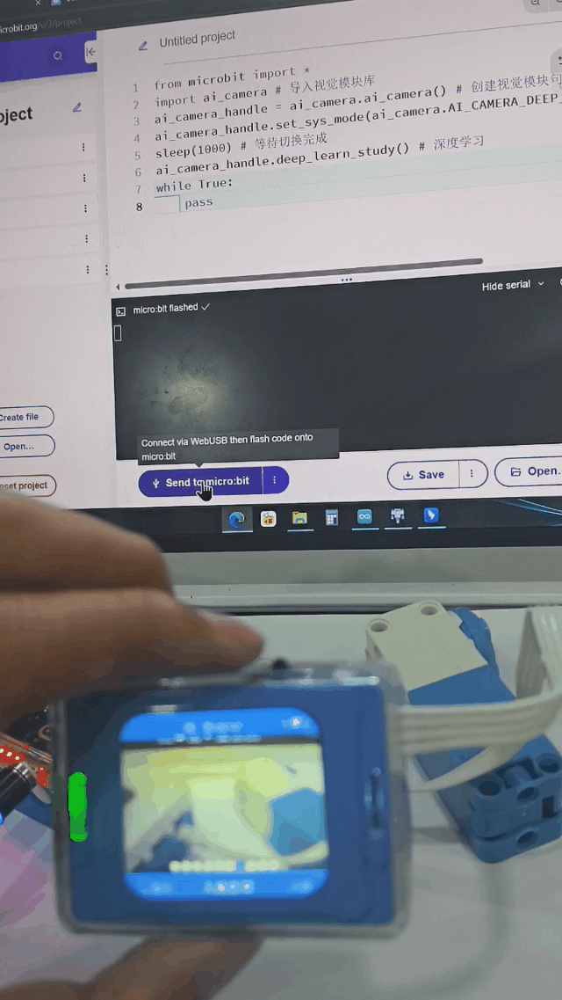

After the script is uploaded, the vision module switches to Deep Learning mode and performs deep learning.  

**<font style="color:rgb(118, 131, 144);background-color:rgb(34, 39, 46);"></font>**

#### get_identify_num
+ get_identify_num(features, total=0)

 Get the Number of Recognized Objects or Determine Whether an Object Is Recognized  


**Parameters：**

+ features Function Selection
    - AI_CAMERA_PATCH   # Color Block Tracking
    - AI_CAMERA_TAG     # Tag Recognition
    - AI_CAMERA_LINE    # Line Detection
    - AI_CAMERA_20_CLASS# 20-Class Object Recognition
    - AI_CAMERA_QRCODE  # QR Code Recognition
    - AI_CAMERA_FACE_DE #  Face Detection  
    - AI_CAMERA_FACE_RE # Face Recognition
    - AI_CAMERA_DEEP_LEARN # Deep Learning
    - AI_CAMERA_CARD # Card Recognition
+ total  Total Count  

> In **Face Recognition** mode:  
>
> + When `total = 0` (default), returns the number of learned faces recognized.
> + When `total = 1`, returns the total number of faces detected, including both learned and unlearned faces.
>
>  This parameter is invalid in other modes.  
>

**Return Value：**

+ In`Color Block Recognition、Line Detection、QR Code Recognition、Deep Learning` modes  ，returns `1` when an object is recognized and `0` when no object is recognized.
+ In`Tag Recognition、20-Class Object Recognition、Face Detection、Card Recognition`modes， returns the number of recognized objects.   returns the number of recognized objects.

> In **Face Recognition** mode, the default behavior is to return the number of learned faces recognized. Only when `total = 1` does it return the total number of faces detected in the image, including both unlearned and learned faces.
>

**Usage Example：**

```python
from microbit import *
import color # Import the Color Library
import ai_camera # Import the Vision Module Library
ai_camera_handle = ai_camera.ai_camera() # Create the Vision Module Handle
ai_camera_handle.set_sys_mode(ai_camera.AI_CAMERA_PATCH) # Set the Color Block Tracking Mode
sleep(1000) # Wait for the Mode Switch to Complete
ai_camera_handle.set_find_color(color.YELLOW) # Set the Tracking Color to Yellow
while True:
    # Determine Whether a Color Block Is Recognized
    if ai_camera_handle.get_identify_num(ai_camera.AI_CAMERA_PATCH): 
        print("找到色块")
    else:
        print("未找到色块")
    sleep(400)
```

<!-- 这是一张图片，ocr 内容为： -->
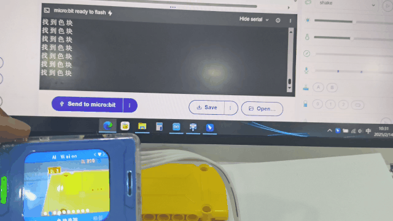

When the vision module detects a yellow object, it draws a bounding box around the object and prints **“Color block found”** through the serial port. When no yellow object is detected, it prints **“Color block not found”** through the serial port.


#### get_qrcode_content
+ get_qrcode_content()

Get the QR Code Recognition  Content  


**Return Value:**

 A string or a list of bytes.  

> The module first attempts to convert the recognized content into a UTF-8 string. If the content is not in a valid string format, the raw recognized data is returned as a list of bytes, for example: [0x12, 0x89, 0x77]。
>


**Usage Example：**

<!-- 这是一张图片，ocr 内容为： -->
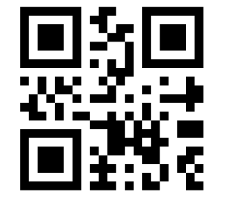

 A QR code containing the content “hello”  

```python
from microbit import *
import ai_camera # Import the Vision Module Library
ai_camera_handle = ai_camera.ai_camera() # Create the Vision Module Handle
ai_camera_handle.set_sys_mode(ai_camera.AI_CAMERA_QRCODE) # Set the QR Code Recognition Mode
sleep(1000) # Wait for the Mode Switch to Complete
while True:
    # Determine Whether a QR Code Is Recognized
    if ai_camera_handle.get_identify_num(ai_camera.AI_CAMERA_QRCODE): 
        text = ai_camera_handle.get_qrcode_content()
        print("二维码内容：", text)
    else:
        print("未识别到二维码")
    sleep(400)
```

<!-- 这是一张图片，ocr 内容为： -->
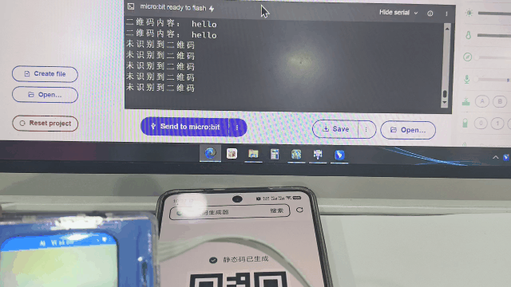

Generate a QR code containing the content **“hello”** using a QR code generation tool. When the vision module detects the QR code, it prints **“QR code content: hello”** through the serial port. When no QR code is detected, it prints **“QR code not detected”** through the serial port.


#### get_identify_id
+ get_identify_id(features, index=0)

 Get the ID of the Recognized Object  

> The meaning of the returned `id` varies depending on the operating mode.
>
> + In **Color Block Tracking** mode, `id` ranges from `1` to `6`, representing **red, green, blue, yellow, black,** and **white**, respectively. The corresponding color macros defined in the `color.py` file can be used for comparison. The returned value is the ID of the configured tracking color, regardless of whether a color block is detected.
> + In **Tag Recognition** mode, `id` ranges from `0` to `...` and represents the ID assigned when the tag was generated, i.e., the ID represented by the tag itself.
> + In **20-Class Object Recognition** mode, `id` ranges from `0` to `19`, representing **“airplane,” “bicycle,” “bird,” “boat,” “bottle,” “bus,” “car,” “cat,” “chair,” “cow,” “dining table,” “dog,” “house,” “motorcycle,” “person,” “potted plant,” “sheep,” “sofa,” “ship,”** and **“TV”**, respectively.
> + In **Face Recognition** and **Deep Learning** modes, `id` ranges from `0` to `3`. These IDs are automatically assigned sequentially during the learning process.
> + In **Card Recognition** mode, `id` ranges from `0` to `7`. The corresponding card meanings are **“Green Light,” “Turn Left,” “Stop,” “Red Light,” “Turn Right,” “Horn,”** and others.
>


**Parameters：**

+ features Function Selection
    - AI_CAMERA_PATCH   # Color Block Tracking （ Single Target  ）
    - AI_CAMERA_TAG     # Tag Recognition （ Single Target  ）
    - AI_CAMERA_20_CLASS# 20-Class Object Recognition （ Multiple Targets  ）
    - AI_CAMERA_FACE_RE # Face Recognition （ Multiple Targets  ）
    - AI_CAMERA_DEEP_LEARN # Deep Learning （ Single Target  ）
    - AI_CAMERA_CARD # Card Recognition （ Multiple Targets  ）
+ index       The index of the recognized object.  
    - **Range**: `0–3`. This parameter is only meaningful when **multiple-object recognition** is supported in the modes listed above.

**Return Value：**

 Recognized Object ID  

> The range and meaning of `id` vary depending on the operating mode. Refer to the description above for details.
>


**Usage Example 1： Determine the Recognized Tag ID  **

<!-- 这是一张图片，ocr 内容为： -->
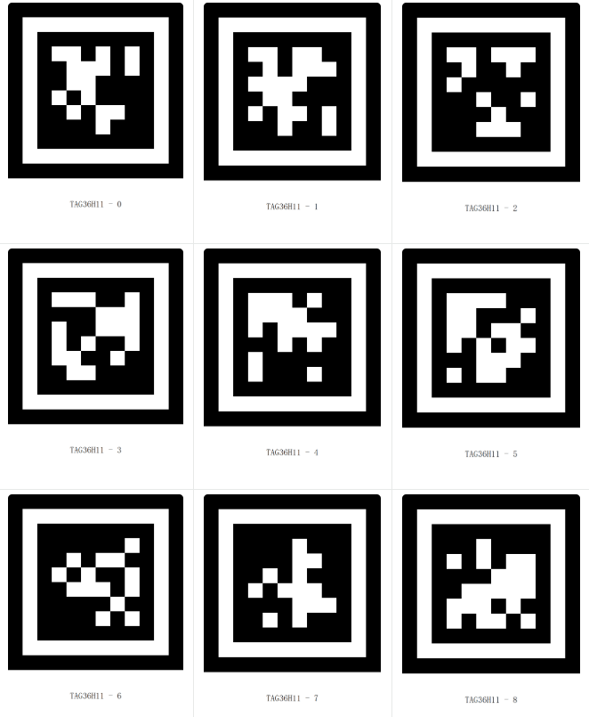


 Tags with IDs ranging from 0 to 8.  


```python
from microbit import *
import ai_camera # Import the Vision Module Library
ai_camera_handle = ai_camera.ai_camera() # Create the Vision Module Handle
ai_camera_handle.set_sys_mode(ai_camera.AI_CAMERA_TAG) # Set the Tag Recognition Mode
sleep(1000) # Wait for the Mode Switch to Complete
while True:
    # Determine Whether a Tag Is Recognized
    if ai_camera_handle.get_identify_num(ai_camera.AI_CAMERA_TAG): 
        # Read the ID Value
        target_id = ai_camera_handle.get_identify_id(ai_camera.AI_CAMERA_TAG)
        print("标签id：", target_id)
    else:
        print("未识别到标签")
    sleep(400)
```

<!-- 这是一张图片，ocr 内容为： -->
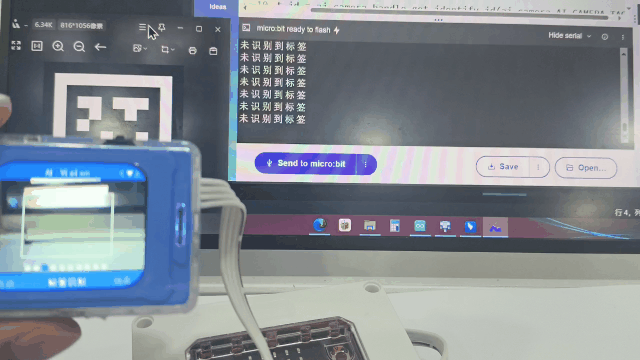

When the vision module does not detect a tag, the serial port prints **“Tag not detected.”** When a tag is detected, its ID is printed.


**Usage Example 2： Determine the Recognized 20-Class Object  **

| <!-- 这是一张图片，ocr 内容为： -->
 | <!-- 这是一张图片，ocr 内容为： -->
 |
| :---: | :---: |


“bicycle”and“car”

```python
from microbit import *
import ai_camera # Import the Vision Module Library
ai_camera_handle = ai_camera.ai_camera() # Create the Vision Module Handle
ai_camera_handle.set_sys_mode(ai_camera.AI_CAMERA_20_CLASS) # Set the 20-Class Object Recognition Mode
sleep(1000) # Wait for the Mode Switch to Complete
while True:
    # Determine Whether a 20-Class Object Is Recognized
    if ai_camera_handle.get_identify_num(ai_camera.AI_CAMERA_20_CLASS): 
        # Read the ID Value
        target_id = ai_camera_handle.get_identify_id(ai_camera.AI_CAMERA_20_CLASS)
        if target_id == 1:
            print("识别到自行车")
        else:
            print("其他物体")
    else:
        print("未识别20类物体")
    sleep(400)
```

<!-- 这是一张图片，ocr 内容为： -->
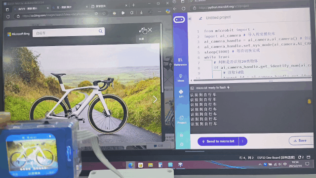

When the vision module detects a **“bicycle”**, the serial port prints **“Bicycle detected.”** When the vision module detects a **“car”**, the serial port prints **“Other object.”** If no object belonging to the 20 supported classes is detected, the serial port prints **“No 20-class object detected.”**


#### get_identify_rotation
+ get_identify_rotation(features, index=0)

 Get the Rotation Angle of the Recognized Object  

> Currently, the rotation angle can only be obtained in **Tag Recognition** mode. In other modes, the returned value is always `0`.
>


**Parameters：**

+ features Function Selection
    - AI_CAMERA_TAG     # Tag Recognition
+ index    Index of the Recognized Object  
    - Default: `0`. In general, `0` is sufficient. This parameter is reserved for future feature expansion.  

**Return Value：**

0~359

**Usage Example：**

<!-- 这是一张图片，ocr 内容为： -->
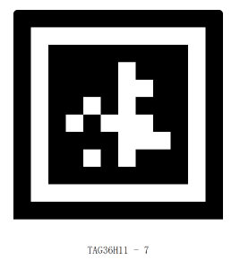

```python
from microbit import *
import ai_camera # Import the Vision Module Library
ai_camera_handle = ai_camera.ai_camera() # Create the Vision Module Handle
ai_camera_handle.set_sys_mode(ai_camera.AI_CAMERA_TAG) # Set the Tag Recognition Mode
sleep(1000) # Wait for the Mode Switch to Complete
while True:
    # Determine Whether a Tag Is Recognized
    if ai_camera_handle.get_identify_num(ai_camera.AI_CAMERA_TAG): 
        # Read the Rotation Angle
        rot = ai_camera_handle.get_identify_rotation(ai_camera.AI_CAMERA_TAG)
        print("标签的角度为:", rot)
    else:
        print("未识别标签")
    sleep(400)
```

<!-- 这是一张图片，ocr 内容为： -->
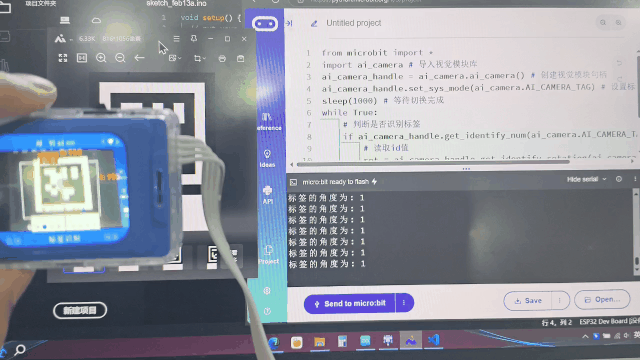

When the vision module detects a tag, rotate the vision module. The serial port will print the angle of the tag relative to the vision module. If no tag is detected, the serial port prints **“Tag not detected.”**

#### get_identify_position
+ get_identify_position(features, index=0)

### Get the Position of the Recognized Object
> + `Line Detection`****has three rectangular bounding boxes. From bottom to top, their `index` values are `0`, `1`, and `2`, respectively.
>


**Parameters:**

+ features Function Selection
    - AI_CAMERA_PATCH   # Color Block Tracking
    - AI_CAMERA_TAG     # Tag Recognition
    - AI_CAMERA_LINE    # Line Detection
    - AI_CAMERA_20_CLASS# 20-Class Object Recognition
    - AI_CAMERA_QRCODE  # QR Code Recognition
    - AI_CAMERA_FACE_DE # Face Detection
    - AI_CAMERA_FACE_RE # Face Recognition
    - AI_CAMERA_DEEP_LEARN # Deep Learning
    - AI_CAMERA_CARD # Card Recognition
+ index Index of the Recognized Object
    -  Default: `0`

**Return Value:**

 Position List  

>  Format  ： [x, y, w, h]。[20, 30, 34, 34]
>


**Usage Example：**

<!-- 这是一张图片，ocr 内容为： -->
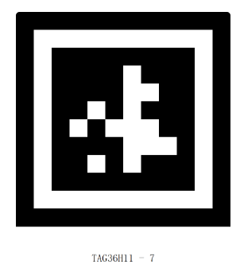

```python
from microbit import *
import ai_camera # Import the Vision Module Library
ai_camera_handle = ai_camera.ai_camera() # Create the Vision Module Handle
ai_camera_handle.set_sys_mode(ai_camera.AI_CAMERA_TAG) # Set the Tag Recognition Mode
sleep(1000) # Wait for the Mode Switch to Complete
while True:
    # Determine Whether a Tag Is Recognized
    if ai_camera_handle.get_identify_num(ai_camera.AI_CAMERA_TAG): 
        # Get the Position List
        pos_list = ai_camera_handle.get_identify_position(ai_camera.AI_CAMERA_TAG)
        pos_x = pos_list[0] # Get the X Coordinate
        print("x y w h：", pos_list)
        if pos_x > 170:
            print("位置偏右")
        else:
            print("位置偏左")
    else:
        print("未识别标签")
    sleep(400)
```

<!-- 这是一张图片，ocr 内容为： -->
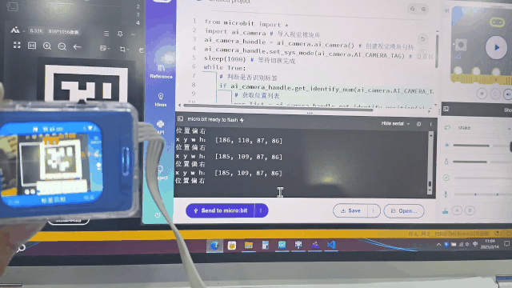

When the vision module detects a tag, the serial port prints the coordinates of the tag. Move the vision module left or right, and it will respectively output **“Tag position is left”** or **“Tag position is right.”** If no tag is detected, the serial port prints **“Tag not detected.”**


#### get_ai_chat_state
+ get_ai_chat_state()

Get the AI Conversation Status  


**Return Value：**

  Returns the current status of the AI conversation.  

**Value Range:**

+ `0`: AI not started
+ `1`: Connecting
+ `2`: Standby
+ `3`: Listening
+ `4`: Speaking
+ `5`: Network configuration in progress


**Usage Example：**

```cpp
from microbit import *
import ai_camera # Import the Vision Module Library

ai_camera_handle = ai_camera.ai_camera() # Create the Vision Module Handle

while True:
    print(ai_camera_handle.get_ai_chat_state())    
    sleep(1000)
```


#### get_ai_chat_run_state
+ get_ai_chat_run_state()

 Obtains the motion command and speed generated during the AI conversation.  


**Return Value：**

 Returns the motion command and motion speed.  

> **Return Format:**  
Example:（1, 50）
>
> **Motion Command Range:**
>
> + `1`: Move forward
> + `2`: Move backward
> + `3`: Turn left
> + `4`: Turn right
> + `5`: Stop
>
> 
>
> **Speed Range:** `0 ~ 100`
>


**Usage Example：**

<!-- 这是一张图片，ocr 内容为： -->
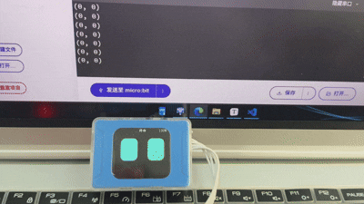

```cpp
from microbit import *
import ai_camera # Import the Vision Module Library

ai_camera_handle = ai_camera.ai_camera() # Create the Vision Module Handle

while True:
    print(ai_camera_handle.get_ai_chat_run_state())    
    sleep(1000)
```


#### get_ai_chat_custom_command
+ get_ai_chat_custom_command()

 Get the Custom Command Value  

****

**Return Value：**

 Custom Command Value  


**Usage Example：**

```cpp
from microbit import *
import ai_camera # Import the Vision Module Library

ai_camera_handle = ai_camera.ai_camera() # Create the Vision Module Handle

while True:
    print(ai_camera_handle.get_ai_chat_custom_command())    
    sleep(1000)
```

****

#### get_wifi_stream_joystick
+ get_wifi_stream_joystick()

 Get the X and Y Values of the Web Joystick


**Return Value：**

 The joystick values in the X and Y directions.  

> Format：（20， -32）
>


**Usage Example：**

<!-- 这是一张图片，ocr 内容为： -->
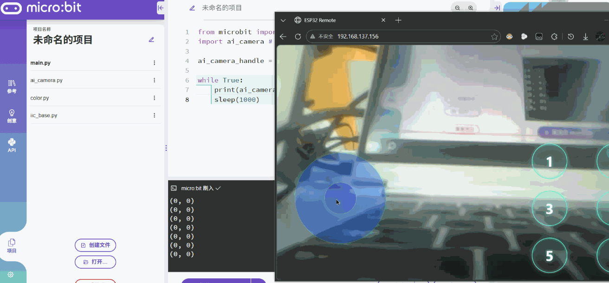

```cpp
from microbit import *
import ai_camera # Import the Vision Module Library
wsad
ai_camera_handle = ai_camera.ai_camera() # Create the Vision Module Handle

while True:
    print(ai_camera_handle.get_wifi_stream_joystick())    
    sleep(1000)
```

****

#### get_wifi_stream_button
+ get_wifi_stream_button()

Get the Button Value of the Wireless Video Transmission Web Interface  


**Return Value：**

 Button value.  

The corresponding bit positions of each button in one byte are as follows:

`0012 3456`

When a button is pressed, the corresponding bit is set to `1`.


**Usage Example：**

```cpp
from microbit import *
import ai_camera # Import the Vision Module Library

ai_camera_handle = ai_camera.ai_camera() # Create the Vision Module Handle

while True:
    print(ai_camera_handle.get_wifi_stream_button())    
    sleep(1000)
```


#### get_wifi_stream_keyboard
+ get_wifi_stream_keyboard()

Get the WASD Keyboard Values from the Wireless Video Transmission Interface  


**Return Value：**

WASD keyboard key value.

The corresponding bit positions of each key in one byte are as follows:

`0000 WASD`. When a key is pressed, the corresponding bit is set to `1`.


**Usage Example：**

```cpp
from microbit import *
import ai_camera # Import the Vision Module Library

ai_camera_handle = ai_camera.ai_camera() # Create the Vision Module Handle

while True:
    print(ai_camera_handle.get_wifi_stream_keyboard())    
    sleep(1000)
```

****

#### get_wifi_stream_ssid_passward
+ get_wifi_stream_ssid_passward()

 Get the Connected Wi-Fi Name and Password  


**Return Value：**

 Wi-Fi Name and Password  

> Format:（"ssid", "password"）
>


**Usage Example：**

```cpp
from microbit import *
import ai_camera # Import the Vision Module Library

ai_camera_handle = ai_camera.ai_camera() # Create the Vision Module Handle

while True:
    print(ai_camera_handle.get_wifi_stream_ssid_passward())    
    sleep(1000)
```

****

#### get_wifi_stream_ip
+ get_wifi_stream_ip()

 Get the IP Address Connected to Wi-Fi  


**Return Value：**

 Wi-Fi Connected IP Address  


**Usage Example：**

```cpp
from microbit import *
import ai_camera # Import the Vision Module Library

ai_camera_handle = ai_camera.ai_camera() # Create the Vision Module Handle

while True:
    print(ai_camera_handle.get_wifi_stream_ip())    
    sleep(1000)
```


